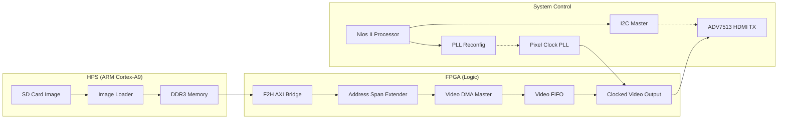

# DE10-Nano DDR-to-HDMI 비디오 파이프라인 설계서

본 문서는 DE10-Nano 플랫폼에서 HPS DDR3 메모리에 저장된 영상 데이터를 HDMI 인터페이스를 통해 출력하기 위한 비디오 파이프라인의 아키텍처 및 세부 설계 사항을 기술합니다.

## 1. 시스템 아키텍처 및 데이터 흐름

영상 데이터는 고속 전송 대역폭 확보를 위해 다음과 같은 경로를 통해 최종 출력 장치로 전달됩니다.

**SD Card (ARM/Linux) ➡️ DDR3 Memory ➡️ Video DMA (FPGA) ➡️ HDMI TX (ADV7513)**

---

## 2. 주요 구성 요소별 기능 정의

### HPS (ARM/Linux Core)
- **데이터 로딩**: SCP 등을 통해 SD 카드에 저장된 영상 소스를 리눅스 파일 시스템으로 반입합니다.
- **메모리 매핑**: 리눅스 사용자 공간 어플리케이션을 통해 영상 데이터를 DDR3의 사전에 정의된 특정 영역(예: 32MB Offset)에 할당합니다.
- **성능 이점**: FPGA-to-HPS AXI 브릿지를 활용하여 ARM과 FPGA 간의 고속 공유 메모리 접근 환경을 제공합니다.

### Nios II Processor (Control Layer)
- **주변 장치 구성**: I2C Master를 통해 ADV7513 HDMI Transmitter의 레지스터를 초기화합니다 (Power 관리, Color Format 설정 등).
- **해상도 동적 가변**: `Altera PLL Reconfig` IP를 제어하여 출력 해상도(480p, 720p 등)에 부합하는 Pixel Clock(25.2MHz, 74.25MHz 등)을 실시간으로 생성합니다.
- **파이프라인 관리**: Video DMA의 동작을 트리거하고 시스템 상태를 모니터링합니다.

### FPGA Fabric (High-Speed Data Path)
- **Video DMA Master**: Avalon-MM Master 인터페이스를 기반으로 DDR3의 픽셀 데이터를 Burst 단위로 인출합니다.
- **Clocked Video Output (CVO)**: 인출된 스트리밍 데이터를 HDMI 표준 규격에 부합하는 타이밍 신호(HSync, VSync, Data Enable)로 변환합니다.
- **대역폭 최적화**: FPGA-to-HPS AXI Slave Bridge를 경유함으로써 실시간 영상 처리에 충분한 100MB/s 이상의 전송 속도를 확보합니다.

---

## 3. 기술적 설계 결정 사항 (Technical Decisions)

1. **ARM 기반 데이터 반입**: JTAG(HostFS) 대비 전송 속도가 월등히 빠른 ARM-Linux 기반의 SD 카드 데이터 로딩 방식을 채택하였습니다.
2. **Nios II 통합 제어**: I2C 통신 및 PLL 재구성 로직을 소프트웨어 계층(Nios II)에서 제어함으로써, 하드웨어 변경 없이 다양한 해상도 및 설정 변화에 유연하게 대응합니다.
3. **Avalon-MM 및 AXI 계층 구조**: 내부 버스는 Avalon-MM 인터페이스를 유지하되, Address Span Extender를 통해 HPS의 AXI 인프라를 활용함으로써 시스템 안정성을 극대화하였습니다.

---

## 4. 구현 로드맵 (Implementation Roadmap)

1. **Qsys 하드웨어 구성**: PLL Reconfig, I2C Master, Video DMA, CVO IP의 통합 및 버스 연결.
2. **Top-level RTL 통합**: 생성된 Qsys 시스템과 물리적 HDMI 출력 핀 간의 배선 작업.
3. **제어 소프트웨어 개발**: Nios II 기반 ADV7513 제어 드라이버 및 PLL 제어 API 구현.
4. **ARM 측 이미지 전송 구현**: Linux 환경에서 DDR3 메모리로 데이터를 전송하는 로더 프로그램 개발.
5. **검증 및 최적화**: 출력 해상도별 타이밍 검증 및 최종 디스플레이 출력 테스트.
