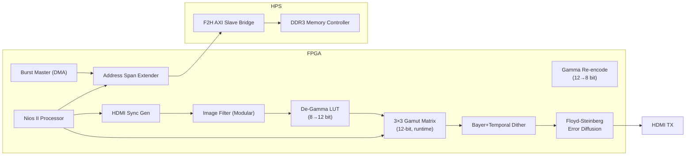

# DE10-Nano Video Processing Project

## 📌 Project Overview
This project implements high-performance video data movement between the FPGA and HPS DDR3 memory on the DE10-Nano (Cyclone V SoC). 
By utilizing the **FPGA-to-HPS AXI Bridge**, we bypass the common preloader/bridge lock issues and achieve stable, high-speed DMA access suitable for real-time video processing.

## 🚀 Key Achievements
- **DDR3 Connectivity**: Successfully resolved system hangs by relocating memory access from the locked SDRAM port to the AXI Bridge.
- **Hardware DMA Master**: Integrated a custom `burst_master` (Avalon-MM) to perform high-speed data transfers.
- **Performance Optimized**: Achieved ~30x throughput improvement using hardware-driven bursts compared to software-based copy loops.
- **Stable Coherency**: Implemented proper cache management (`alt_dcache_flush_all`) for reliable data shared between Nios II and hardware masters.

- **Advanced HDMI Control**: Implemented sophisticated gamma correction (sRGB, Inverse Gamma 2.2) and custom character tile-rendering.
- **12-bit High-Precision Pipeline**: Upgraded internal bit-depth of De-gamma, 3×3 Matrix, and Gamma stages to **12-bit (4096 levels)**. This prevents "Dark Crushing" and banding artifacts by preserving subtle shadow details that are typically lost in 8-bit linear space.
- **Real-time Image Filtering**: Integrated a modular filter pipeline (Blur, Edge, Emboss, Sharpen) achieving 60fps at 540p.
- **Advanced Dithering System**: Implemented True Ordered Dithering with 2D Temporal Scrambling and RGB Channel Decorrelation to eliminate 4-bit color banding.
- **3×3 Gamut Transfer Matrix**: Added a runtime-configurable 3×3 color matrix in Q2.10 fixed-point, enabling sRGB gamut mapping, saturation control, and display calibration. Combined with the dithering stage, it enables **perceptually accurate color reproduction even on LED panels where low-luminance emission is non-linear**.
- **RTL Verification Framework**: Established a `cocotb` + `pytest` environment for cycle-accurate simulation with real image data.
- **Stable Address Mapping**: Fixed Avalon-MM byte-to-word addressing issues, ensuring reliable register control.

## 🏗 System Architecture

## Performance Summary

| Data Path | Method | Throughput | Verification |
| :--- | :--- | :--- | :--- |
| **OCM to DDR3** | Software Copy (CPU) | 4.55 MB/s | Baseline |
| | **Hardware DMA (Burst)** | **136.53 MB/s** | **~30x Speedup** |
| **DDR3 to DDR3** | Software (w/ Arithmetic) | 0.21 MB/s | Reference |
| | **Hardware DMA (BM4/Pipe)** | **125.00 MB/s** | **~585x Speedup** |
| **Real-time Filter**| **960x540p @ 60fps** | **~93 MB/s** | **Zero Jitter** |

## 🎨 Advanced Dithering Demonstration

To overcome the visual artifacts (color banding) caused by truncating 8-bit color channels to 4-bit, we implemented an Advanced True Ordered Dithering algorithm.

### Original (24-bit)

### Hard Clamped (4-bit, No Dither, < 0x10 Black)

### Advanced 2-Stage Dithered (Hybrid Temporal & Floyd-Steinberg)

### Quantitative Visual Quality Assessment: +3.30 dB PSNR Improvement
Our quantitative analysis shows that the **2-Stage Hybrid** architecture achieves a significant **+3.30 dB improvement in PSNR** compared to simple truncation. This proves that our "Seamless Error Propagation" logic successfully restores missing details in extreme low-grayscale regions.

**Key Techniques used in our RTL pipeline:**
1. **Pass 1 (Temporal Ordered Dither):** Applies a 2-bit temporally scrambled Bayer matrix strictly to ultra-dark areas (`< 0x04`) to inject high-frequency dynamic noise.
2. **Pass 2 (Conditional Error Diffusion):** Implements a **Floyd-Steinberg** algorithm using a single BRAM line buffer. It diffuses quantization errors across the spatial domain ($7/16, 3/16, 5/16, 1/16$).
3. **Seamless Error Propagation:** Unconditionally propagates errors from the BRAM even when a pixel bypasses dithering (Value > Threshold). This ensures perfect mathematical energy conservation across high-contrast boundaries.
4. **RGB Channel Decorrelation:** R, G, and B matrices are spatially offset to push noise from the sensitivity of the Luminance domain into the Chrominance domain.

> [!IMPORTANT]
> **Gamut Transfer × Dithering Synergy for LED Displays**
>
> LED display panels often have non-linear emission in the low-luminance range — the backlight or individual LEDs may not emit below a certain threshold, causing crushed blacks and color inaccuracies. Simply applying a 3×3 gamut matrix is insufficient because the mapped colors may still fall into non-emissive regions.
>
> The key insight is the **pipeline order**:
> **De-Gamma → 3×3 Gamut Matrix → Bayer/Temporal Dither → Error Diffusion**
>
> The dithering stage operates *after* the color matrix, on the already-corrected pixel values. This means that even if the target color value is below the LED emission threshold, the dithering injects energy into neighboring pixels and frames that *are* above the threshold. The Floyd-Steinberg error diffusion then redistributes the residual quantization error spatially. The net result is **perceptually accurate color even in regions where the LED hardware cannot directly render the desired luminance level** — effectively "borrowing" emission from nearby pixels and time steps.

## 📖 Documentation
- [DESIGN.md](doc/DESIGN.md): Comprehensive system architecture and DDR-to-HDMI pipeline specification.
- [DITHER.md](doc/DITHER.md): Detailed lecture on Advanced Dithering theory and techniques.
- [NIOS.md](doc/NIOS.md): Detailed Interactive Menu tree structure and control logic.
- [BURST_DMA.md](doc/BURST_DMA.md): Detailed debugging history, performance benchmarks, and memory protection strategies.
- [STUDY.md](doc/STUDY.md): Technical study notes on HDMI timing, ADV7513, and video processing.
- [RESULT.md](doc/RESULT.md): Official performance benchmark results and hardware status logs.
- [CALIBRATION.md](doc/CALIBRATION.md) / [CAL_eng.md](doc/CAL_eng.md): Theory and methodology for 3x3 Gamut adjustment and Display calibration.
- [TODO.md](doc/TODO.md): Project roadmap and remaining tasks.
- [soc_system.qsys](./soc_system.qsys): Platform Designer (Qsys) hardware configuration.
- [nios_software/](./nios_software/): Nios II benchmark and verification source code.
