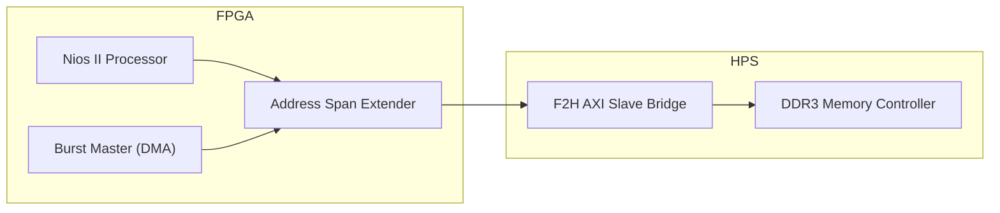

# DE10-Nano Video Processing Project

## 📌 Project Overview
This project implements high-performance video data movement between the FPGA and HPS DDR3 memory on the DE10-Nano (Cyclone V SoC). 
By utilizing the **FPGA-to-HPS AXI Bridge**, we bypass the common preloader/bridge lock issues and achieve stable, high-speed DMA access suitable for real-time video processing.

## 🚀 Key Achievements
- **DDR3 Connectivity**: Successfully resolved system hangs by relocating memory access from the locked SDRAM port to the AXI Bridge.
- **Hardware DMA Master**: Integrated a custom `burst_master` (Avalon-MM) to perform high-speed data transfers.
- **Performance Optimized**: Achieved ~30x throughput improvement using hardware-driven bursts compared to software-based copy loops.
- **Stable Coherency**: Implemented proper cache management (`alt_dcache_flush_all`) for reliable data shared between Nios II and hardware masters.

## 🏗 System Architecture

## Performance Summary

| Data Path | Method | Throughput | Verification |
| :--- | :--- | :--- | :--- |
| **OCM to DDR3** | Software Copy (CPU) | 4.55 MB/s | Baseline |
| | **Hardware DMA (Burst)** | **136.53 MB/s** | **~30x Speedup** |
| **DDR3 to DDR3** | Software (w/ Arithmetic) | 0.21 MB/s | Reference |
| | **Hardware DMA (BM4/Pipe)** | **125.00 MB/s** | **~585x Speedup** |

## 📖 Documentation
- [DESIGN.md](doc/DESIGN.md): Comprehensive system architecture and DDR-to-HDMI pipeline specification.
- [BURST_DMA.md](doc/BURST_DMA.md): Detailed debugging history, performance benchmarks, and memory protection strategies.
- [STUDY.md](doc/STUDY.md): Technical study notes on HDMI timing, ADV7513, and video processing.
- [RESULT.md](doc/RESULT.md): Official performance benchmark results and hardware status logs.
- [TODO.md](doc/TODO.md): Project roadmap and remaining tasks.
- [soc_system.qsys](./soc_system.qsys): Platform Designer (Qsys) hardware configuration.
- [nios_software/](./nios_software/): Nios II benchmark and verification source code.
