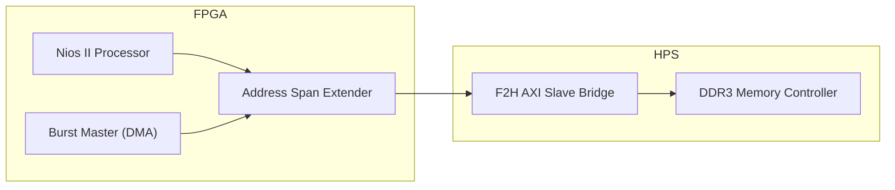

# DE10-Nano Video Processing Project

## 📌 Project Overview
This project implements high-performance video data movement between the FPGA and HPS DDR3 memory on the DE10-Nano (Cyclone V SoC). 
By utilizing the **FPGA-to-HPS AXI Bridge**, we bypass the common preloader/bridge lock issues and achieve stable, high-speed DMA access suitable for real-time video processing.

## 🚀 Key Achievements
- **DDR3 Connectivity**: Successfully resolved system hangs by relocating memory access from the locked SDRAM port to the AXI Bridge.
- **Hardware DMA Master**: Integrated a custom `burst_master` (Avalon-MM) to perform high-speed data transfers.
- **Performance Optimized**: Achieved ~30x throughput improvement using hardware-driven bursts compared to software-based copy loops.
- **Stable Coherency**: Implemented proper cache management (`alt_dcache_flush_all`) for reliable data shared between Nios II and hardware masters.

## 🏗 System Architecture

## 📊 Performance Summary
| Method | Throughout | Improvement |
| :--- | :--- | :--- |
| Software Copy (CPU) | 4.55 MB/s | Baseline |
| **Hardware DMA (Burst)** | **136.53 MB/s** | **~30.0x faster** |

## 📖 Documentation
- [BURST_DMA.md](./BURST_DMA.md): Detailed debugging history, trial & error, and technical implementation details.
- [soc_system.qsys](./soc_system.qsys): Platform Designer configuration.
- [nios_software/](./nios_software/): Nios II benchmark and verification source code.
