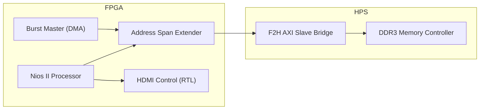

# DE10-Nano Video Processing Project
[**English**] | [**한국어**](./README_kor.md)

## 📌 Project Overview
This project implements high-performance video data movement between the FPGA and HPS DDR3 memory on the DE10-Nano (Cyclone V SoC). 
By utilizing the **FPGA-to-HPS AXI Bridge**, we bypass the common preloader/bridge lock issues and achieve stable, high-speed DMA access suitable for real-time video processing.

## 🚀 Key Achievements
- **DDR3 Connectivity**: Successfully resolved system hangs by relocating memory access from the locked SDRAM port to the AXI Bridge.
- **Hardware DMA Master**: Integrated a custom `burst_master` (Avalon-MM) to perform high-speed data transfers.
- **Performance Optimized**: Achieved ~30x throughput improvement using hardware-driven bursts compared to software-based copy loops.
- **Stable Coherency**: Implemented proper cache management (`alt_dcache_flush_all`) for reliable data shared between Nios II and hardware masters.

- **Video Pipeline Optimization**: Resolved timing violations (Negative Slack -6.5ns) by applying asynchronous clock group constraints in SDC.
- **Advanced HDMI Control**: Implemented sophisticated gamma correction (sRGB, Inverse Gamma 2.2) and custom character tile-rendering (Mode 7).
- **Stable Address Mapping**: Fixed Avalon-MM byte-to-word addressing issues, ensuring reliable register control.

### 🎬 Video Playback (New!)
- **qHD Resolution (960×540@60Hz)**: Optimized for 50MHz bus bandwidth (124 MB/s vs 200 MB/s available)
- **Static Image Display**: Nios II software loads and displays images from DDR3
- **Linux Video Playback**: High-performance "Store-and-Forward" architecture (RAM Preload)
- **Network Streaming**: Support for piping video from host PC via SSH (`cat | ssh`)
- **Dual-Clock Architecture**: Separate CSR (50MHz) and Pixel (37.8MHz) clocks with proper CDC
- **V-Sync Synchronization**: Tear-free frame updates via hardware latching

## 🏗 System Architecture

## Performance Summary

| Data Path | Method | Throughput | Verification |
| :--- | :--- | :--- | :--- |
| **OCM to DDR3** | Software Copy (CPU) | 4.55 MB/s | Baseline |
| | **Hardware DMA (Burst)** | **136.53 MB/s** | **~30x Speedup** |
| **DDR3 to DDR3** | Software (w/ Arithmetic) | 0.21 MB/s | Reference |
| | **Hardware DMA (BM4/Pipe)** | **125.00 MB/s** | **~585x Speedup** |

## 🧪 Verification (Cocotb)
To strictly validate the video pipeline before hardware deployment, we utilized **Cocotb** for bit-accurate verification. This process simulates the actual hardware environment and compares the output against a reference image pixel-by-pixel.

### 🔍 Verification Process (Step-by-Step)
1. **Image Preloading (`image.raw`)**:
   - The Python testbench (`tb_video_integration.py`) reads a raw binary image file and preloads it into a **DDR3 Memory Model**.
   - This effectively simulates the Linux environment where the video frame is already validated in physical memory.

2.  **RTL Simulation Execution**:
    - The FPGA RTL core (`video_dma_master`, `fifo`, `pipeline`) initiates DMA transactions to fetch data from the memory model.
    - Data flows through the processing pipeline and is transmitted according to strict HDMI timing specifications.

3.  **Output Capture (`hdmi_output.bin`)**:
    - The testbench monitors the HDMI output signals (`hdmi_de`, `hdmi_d`) and captures valid pixel data into a binary file (`hdmi_output.bin`) during the active video period.

4.  **Automated Integrity Check (`bin2bmp.py`)**:
    - A post-simulation script compares the **Captured Output** against the **Original Input** to verify data integrity.
    - Pass Condition: **Bit-perfect match** for every pixel in the 960x540 frame.

> **Note**: This rigorous verification workflow allowed us to identify and resolve critical issues, such as FIFO overflows and CDC (Clock Domain Crossing) errors, prior to hardware synthesis.

## 📖 Documentation
- [VIDEO_PLAYBACK.md](doc/VIDEO_PLAYBACK.md) | [국문](doc/VIDEO_PLAYBACK_kor.md): **⭐ NEW** - qHD video playback implementation, Linux integration, and performance analysis.
- [DESIGN.md](doc/DESIGN.md) | [국문](doc/DESIGN_kor.md): Comprehensive system architecture and DDR-to-HDMI pipeline specification.
- [NIOS.md](doc/NIOS.md) | [국문](doc/NIOS_kor.md): Detailed Interactive Menu tree structure and control logic.
- [BURST_DMA.md](doc/BURST_DMA.md) | [국문](doc/BURST_DMA_kor.md): Detailed debugging history, performance benchmarks, and memory protection strategies.
- [STUDY.md](doc/STUDY.md) | [국문](doc/STUDY_kor.md): Technical study notes on HDMI timing, ADV7513, and video processing.
- [RESULT.md](doc/RESULT.md) | [국문](doc/RESULT_kor.md): Official performance benchmark results and hardware status logs.
- [TRYERROR.md](./TRYERROR.md) | [국문](./TRYERROR_kor.md): **⭐ NEW** - Troubleshooting log for DMA, FIFO, and HDMI integration issues.
- [TODO.md](doc/TODO.md) | [국문](doc/TODO_kor.md): Project roadmap and remaining tasks.
- [soc_system.qsys](./soc_system.qsys): Platform Designer (Qsys) hardware configuration.
- [nios_software/](./nios_software/): Nios II benchmark and verification source code.
- [linux_software/](./linux_software/): Linux HPS applications for video playback.
