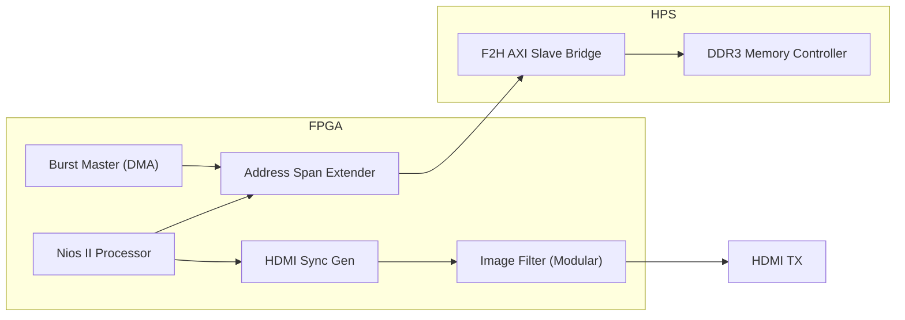
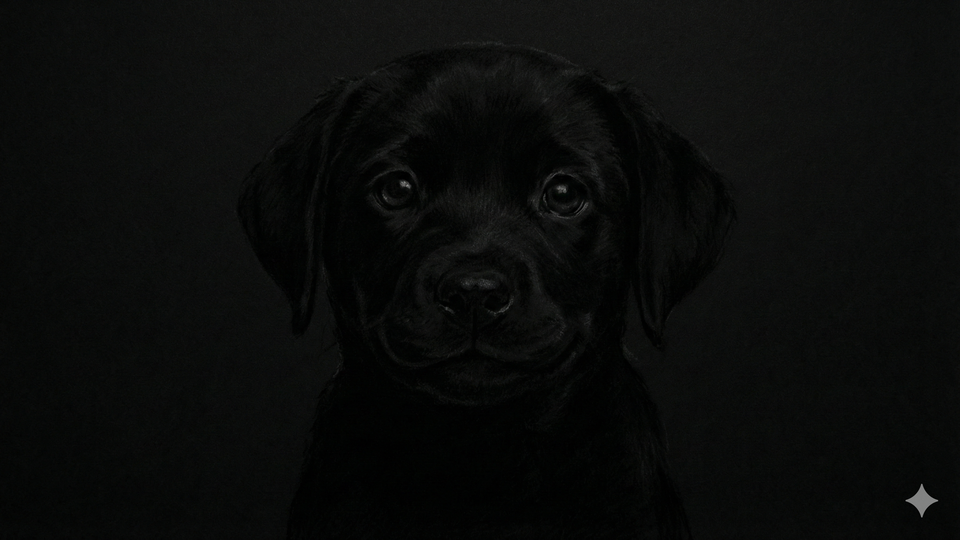
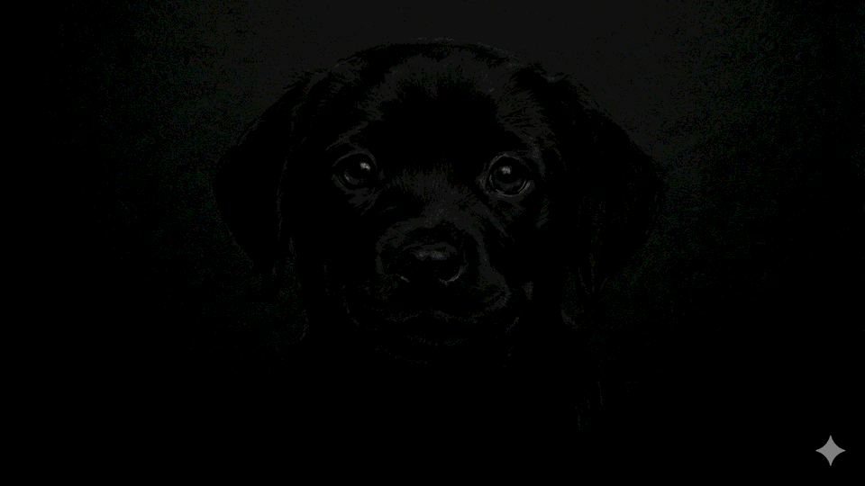
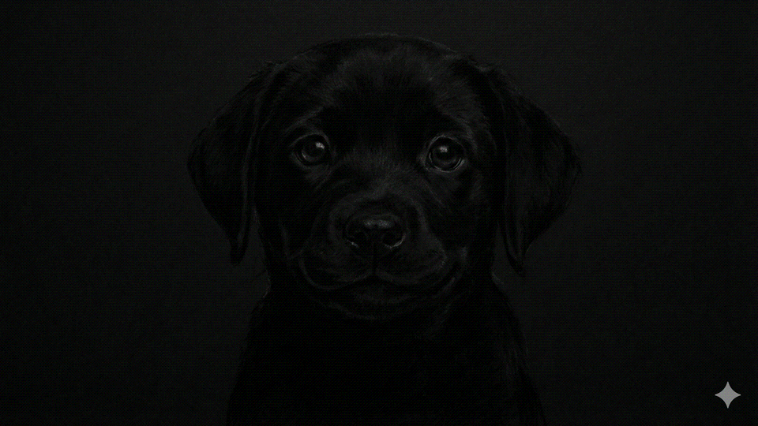

# DE10-Nano Video Processing Project

## 📌 Project Overview
This project implements high-performance video data movement between the FPGA and HPS DDR3 memory on the DE10-Nano (Cyclone V SoC). 
By utilizing the **FPGA-to-HPS AXI Bridge**, we bypass the common preloader/bridge lock issues and achieve stable, high-speed DMA access suitable for real-time video processing.

## 🚀 Key Achievements
- **DDR3 Connectivity**: Successfully resolved system hangs by relocating memory access from the locked SDRAM port to the AXI Bridge.
- **Hardware DMA Master**: Integrated a custom `burst_master` (Avalon-MM) to perform high-speed data transfers.
- **Performance Optimized**: Achieved ~30x throughput improvement using hardware-driven bursts compared to software-based copy loops.
- **Stable Coherency**: Implemented proper cache management (`alt_dcache_flush_all`) for reliable data shared between Nios II and hardware masters.

- **Advanced HDMI Control**: Implemented sophisticated gamma correction (sRGB, Inverse Gamma 2.2) and custom character tile-rendering.
- **Real-time Image Filtering**: Integrated a modular filter pipeline (Blur, Edge, Emboss, Sharpen) achieving 60fps at 540p.
- **Advanced Dithering System**: Implemented True Ordered Dithering with 2D Temporal Scrambling and RGB Channel Decorrelation to eliminate 4-bit color banding.
- **RTL Verification Framework**: Established a `cocotb` + `pytest` environment for cycle-accurate simulation with real image data.
- **Stable Address Mapping**: Fixed Avalon-MM byte-to-word addressing issues, ensuring reliable register control.

## 🏗 System Architecture

```mermaid
graph LR
    subgraph FPGA
        Nios["Nios II Processor"]
        BM["Burst Master (DMA)"]
        ASE["Address Span Extender"]
        HCP["HDMI Sync Gen"]
        FLT["Image Filter (Modular)"]
    end

    subgraph HPS
        AXI["F2H AXI Slave Bridge"]
        DDR["DDR3 Memory Controller"]
    end

    Nios --> ASE
    Nios --> HCP
    BM --> ASE
    ASE --> AXI
    AXI --> DDR
    HCP --> FLT
    FLT --> Output[HDMI TX]
```

## Performance Summary

| Data Path | Method | Throughput | Verification |
| :--- | :--- | :--- | :--- |
| **OCM to DDR3** | Software Copy (CPU) | 4.55 MB/s | Baseline |
| | **Hardware DMA (Burst)** | **136.53 MB/s** | **~30x Speedup** |
| **DDR3 to DDR3** | Software (w/ Arithmetic) | 0.21 MB/s | Reference |
| | **Hardware DMA (BM4/Pipe)** | **125.00 MB/s** | **~585x Speedup** |
| **Real-time Filter**| **960x540p @ 60fps** | **~93 MB/s** | **Zero Jitter** |

## 🎨 Advanced Dithering Demonstration

To overcome the visual artifacts (color banding) caused by truncating 8-bit color channels to 4-bit, we implemented an Advanced True Ordered Dithering algorithm.

| Original (24-bit) | Hard Clamped (4-bit, No Dither, < 0x10 Black) | Advanced Dithered (4-bit, Temporal Scrambled GIF) |
| :---: | :---: | :---: |
|  |  |  |

**Key Techniques used in our RTL pipeline:**
1. **0x10 Thresholding:** Assuming pixels `< 0x10` emit no light on the 4-bit monitor, dithering is only conditionally mathematically applied to preserve pure blacks while perfectly distributing mid-tones.
2. **RGB Channel Decorrelation:** Instead of applying the precise same 4x4 Bayer matrix to all colors simultaneously (which causes harsh Luma grid spots), the R, G, and B matrices are spatially offset from each other.
3. **2D Temporal Scrambling:** The starting coordinates of the matrix are pseudo-randomly shifted every vertical sync frame, turning static grid patterns into a smooth, film-grain-like brightness illusion.

## 📖 Documentation
- [DESIGN.md](doc/DESIGN.md): Comprehensive system architecture and DDR-to-HDMI pipeline specification.
- [DITHER.md](doc/DITHER.md): Detailed lecture on Advanced Dithering theory and techniques.
- [NIOS.md](doc/NIOS.md): Detailed Interactive Menu tree structure and control logic.
- [BURST_DMA.md](doc/BURST_DMA.md): Detailed debugging history, performance benchmarks, and memory protection strategies.
- [STUDY.md](doc/STUDY.md): Technical study notes on HDMI timing, ADV7513, and video processing.
- [RESULT.md](doc/RESULT.md): Official performance benchmark results and hardware status logs.
- [TODO.md](doc/TODO.md): Project roadmap and remaining tasks.
- [soc_system.qsys](./soc_system.qsys): Platform Designer (Qsys) hardware configuration.
- [nios_software/](./nios_software/): Nios II benchmark and verification source code.
