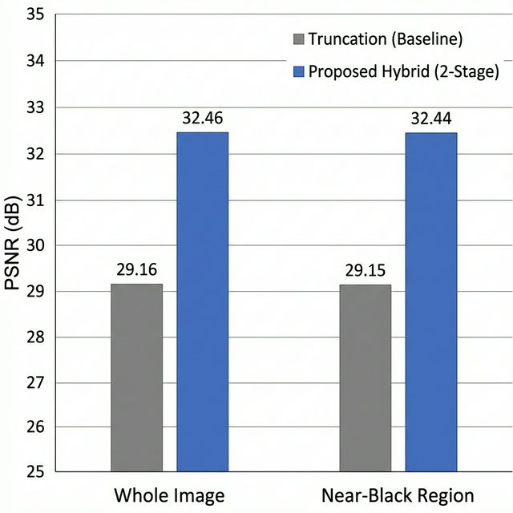

# DE10-Nano Real-Time Video Processing Pipeline

A hardware-accelerated video processing system on the DE10-Nano (Cyclone V SoC), implementing a full display quality pipeline — from DDR3 DMA to HDMI output — with professional-grade color science and dithering for LED displays.

---

## 📌 Project Overview

This project streams video from HPS DDR3 memory through an FPGA pixel pipeline to an HDMI display at **960×540p @ 60fps with zero tearing**. The FPGA handles all real-time quality processing: spatial filtering, color space conversion, gamut calibration, and advanced dithering — entirely in RTL.

**🚀 [NEW] SMPTE ST 2110 Hybrid Receiver Integration**
The system has been expanded to support professional **SMPTE ST 2110-20 Video over IP** reception. It features a unique hybrid architecture where the ARM HPS handles network decap (via `AF_PACKET` raw sockets and `mmap` zero-copy directly to DDR), while the FPGA fabric handles high-speed header stripping and video streaming.

**Key Results at a Glance**

| Data Path | Method | Throughput | Speedup |
| :--- | :--- | :--- | :--- |
| OCM → DDR3 | Software (CPU loop) | 4.55 MB/s | Baseline |
| OCM → DDR3 | **Hardware DMA (Burst)** | **136.53 MB/s** | **~30×** |
| DDR3 → DDR3 | Software (w/ arithmetic) | 0.21 MB/s | Baseline |
| DDR3 → DDR3 | **Hardware DMA (4-Stage pipeline)** | **125.00 MB/s** | **~585×** |
| Real-time filter | **960×540p @ 60fps** | **~93 MB/s** | Zero jitter |

---

## 🏗 System Architecture

```
PC Transmitter (st2110_tx.py)
      │
      ▼  (RNDIS USB / GbE network)
ARM (Linux/HPS)                     FPGA Pixel Pipeline (37.8 MHz)
────────────────                    ──────────────────────────────────────────────────
Raw ST 2110           mmap          F2H AXI     Burst    Video    Sync
AF_PACKET Socket ─────────────►    Bridge  ──► Master ──► FIFO ──► Gen
into DDR3 @                                                          │
0x30000000 (Ring Buffer)                                             ▼
                                                              Image Filter
                                                          (Blur/Edge/Emboss/Sharpen)
                                                                     │
                                                                     ▼
                                                            De-Gamma LUT (8→12 bit)
                                                                     │
                                                                     ▼
                                                         3×3 Gamut Matrix (12-bit)
                                                           runtime-configurable
                                                                     │
                                                                     ▼
                                                     Bayer + Temporal Dither (post-matrix)
                                                                     │
                                                                     ▼
                                                       Floyd-Steinberg Error Diffusion
                                                                     │
                                                                     ▼
                                                            ADV7513 HDMI TX
```

---

## 1. Image Quality Pipeline

### 1.1 High-Precision 12-bit Internal Path

All color processing between De-Gamma and Gamma stages operates at **12-bit (4096 levels)** rather than 8-bit. This prevents **Dark Crushing** — the loss of shadow detail that occurs when dark sRGB values are mapped to linear space.

In 8-bit linear space, sRGB values 1–15 all collapse to near-zero ($15/255^{2.2} \approx 0.002 \rightarrow 0/255$). Expanding to 12-bit preserves these distinct steps ($15/255^{2.2} \times 4095 \approx 8$), ensuring the 3×3 matrix can process subtle shadow gradients without banding artifacts.

| Stage | Module | Bit-depth | Description |
| :--- | :--- | :--- | :--- |
| 1 | `image_filter` | 8-bit | 3×3 spatial convolution |
| 2 | `filter_degamma` | **8→12 bit** | sRGB → Linear via 256×12-bit LUT |
| 3 | `filter_color_matrix` | **12-bit** | 3×3 gamut transfer, Q2.10 fixed-point |
| 4 | `filter_gamma` | **12→8 bit** | Linear → sRGB via 4096×8-bit LUT |
| 5 | `filter_dither` | 8-bit | Bayer + Temporal dithering |
| 6 | `filter_error_diffusion` | 8-bit | Floyd-Steinberg, 960-word BRAM line buffer |

### 1.2 3×3 Color Matrix

The gamut transfer matrix converts linear-light pixel values from the input color space to the display's native color space:

$$\begin{bmatrix} R_{out} \\ G_{out} \\ B_{out} \end{bmatrix} =
\begin{bmatrix} c_{00} & c_{01} & c_{02} \\ c_{10} & c_{11} & c_{12} \\ c_{20} & c_{21} & c_{22} \end{bmatrix}
\begin{bmatrix} R_{in} \\ G_{in} \\ B_{in} \end{bmatrix}$$

Coefficients are stored in **Q2.10 signed fixed-point** (12-bit: 1 sign + 1 integer + 10 fractional bits), loaded at runtime from Nios II via CSR registers.

**RTL Pipeline (3 stages for timing closure)**

```verilog
// Stage 1: Multiply (12-bit unsigned × 12-bit signed = 24-bit signed)
mult_r0 <= $signed({1'b0, r_in}) * C00;
mult_r1 <= $signed({1'b0, g_in}) * C01;
mult_r2 <= $signed({1'b0, b_in}) * C02;

// Stage 2: Adder tree (→ 26-bit signed)
sum_r <= mult_r0 + mult_r1 + mult_r2;

// Stage 3: Shift & clip (right-shift 10 bits, clamp to [0, 4095])
wire signed [15:0] final_r = sum_r >>> 10;
r_out <= (final_r[15]) ? 12'd0 : (final_r > 4095) ? 12'd4095 : final_r[11:0];
```

**Why clipping is necessary:** Off-diagonal coefficients handle color crosstalk correction and can produce negative values for out-of-gamut inputs. The sign-bit check (`final_r[15]`) efficiently detects underflow without a comparator.

### 1.3 Spatial Image Filters

A 3×3 sliding window is implemented using two cascaded line buffers (dual-port BRAM), giving simultaneous access to three rows. All four filter modes compute in parallel with matched 3-clock pipeline latency; mode selection is a runtime CSR write.

| Filter | Kernel | Effect |
| :--- | :--- | :--- |
| **Blur** | $\frac{1}{8}\begin{bmatrix}1&1&1\\1&1&1\\1&1&1\end{bmatrix}$ | Averages neighbors; attenuates high-frequency noise |
| **Edge (Sobel)** | $G = \|G_x\| + \|G_y\|$ | Detects intensity gradients; outputs zero on flat areas |
| **Emboss** | $\begin{bmatrix}-2&-1&0\\-1&1&1\\0&1&2\end{bmatrix}+128$ | Directional difference with neutral-gray offset; 3D depth effect |
| **Sharpen** | $\begin{bmatrix}0&-1&0\\-1&5&-1\\0&-1&0\end{bmatrix}$ | Amplifies center-neighbor difference; preserves original image |

### 1.4 Advanced Dithering for LED Displays

> **The problem this solves:** LED panels have a physical **PWM dead zone** — LEDs below a minimum drive value do not emit light. The 3×3 matrix will produce sub-threshold values (e.g., Green = 5, Blue = 2) for accurate color reproduction; without dithering these are silently clipped to zero, destroying shadow detail and collapsing gamut accuracy.

#### Pipeline order is critical

```
De-Gamma → 3×3 Matrix → [Dither] → Error Diffusion → HDMI
```

Dithering operates on *already-corrected* values. Even if a target color is below the LED emission floor, dithering borrows energy from neighboring pixels and frames that are above threshold. Error diffusion redistributes the residual spatially. The result is perceptually accurate color in regions the hardware cannot directly render.

#### 2-Stage Hybrid Architecture

**Pass 1 — Temporal Ordered Dither (ultra-dark pixels only, `< 0x04`)**

A 4×4 Bayer matrix is applied with 2D temporal scrambling across 16 frame phases:

```verilog
X_offset = {frame_cnt[0], frame_cnt[2]};
Y_offset = {frame_cnt[1], frame_cnt[3]};
```

The frame counter bit-scramble (not a sequential scroll) ensures each of the 16 spatial positions is visited exactly once per 16 frames — mathematically perfect brightness integration, with no visible scroll artifact. The noise pattern becomes perceptual film grain.

**RGB Channel Decorrelation:** The Bayer matrix is read at different spatial offsets per channel (R: 0, G: +1/+2, B: +2/+1), pushing quantization noise from the luminance domain (high eye sensitivity) into the chrominance domain (low eye sensitivity). The harsh luma grid dissolves into soft, even scatter.

**Pass 2 — Low-Gray Energy Accumulator (Floyd-Steinberg with hardware threshold)**

```
if (pixel + incoming_error) < 0x10:
    output = 0x00           // below LED minimum — suppress
    propagate all energy to neighbors (7/16, 3/16, 5/16, 1/16)
else:
    output = accumulated_sum  // fire a real PWM pulse
    error = 0
```

Energy accumulates in a 960-word BRAM line buffer until it exceeds the LED driver's minimum on-time threshold. When it fires, the LED receives a pulse large enough to guarantee real emission. The human eye integrates the resulting sparse bright dots as smooth shadow gradients.

#### Measured Results

| Evaluation Region | Truncation (Baseline) | 2-Stage Hybrid | Improvement |
| :--- | :--- | :--- | :--- |
| Whole image | 29.16 dB | **32.46 dB** | **+3.30 dB** |
| Near-black (`< 0x20`) | 29.15 dB | **32.44 dB** | **+3.29 dB** |

  

*Left: 24-bit original. Center: 4-bit hard truncation (banding, crushed blacks). Right: 2-stage hybrid (+3.30 dB PSNR, recovered shadow detail).*



---

## 2. Display Calibration Methodology

### 2.1 Color Science Foundation

All color matrix operations must be performed in **linear light space**. Standard video signals carry gamma-encoded (non-linear) data; applying a 3×3 matrix directly produces incorrect results. The mandatory pipeline order is:

```
Input RGB → De-Gamma (LUT) → 3×3 Matrix → Re-Gamma (LUT) → Output
```

### 2.2 Deriving the Hardware Matrix

The goal: given a target color standard (e.g., sRGB/D65) and measured native panel data, find the 3×3 matrix $M_{HW}$ such that the panel reproduces the target colors exactly.

**Step 1 — xyY → XYZ conversion**

For each measured primary (R, G, B, W), convert colorimeter readings to absolute XYZ:

$$X = \frac{x}{y} \cdot Y, \quad Y = Y, \quad Z = \frac{1-x-y}{y} \cdot Y$$

**Step 2 — Build RGB-to-XYZ matrices**

Assemble the XYZ coordinates of each primary as column vectors:

$$M_{Target} = \begin{bmatrix} X_r^{tgt} & X_g^{tgt} & X_b^{tgt} \\ Y_r^{tgt} & Y_g^{tgt} & Y_b^{tgt} \\ Z_r^{tgt} & Z_g^{tgt} & Z_b^{tgt} \end{bmatrix}$$

The matrix structure is intuitive: column $i$ is the absolute XYZ emitted when only primary $i$ is driven at full intensity. Matrix multiplication then correctly computes XYZ for any RGB mix by superposition.

**Step 3 — White-Preserving scaling**

Before computing $M_{Native}$, scale each primary column so that $[1, 1, 1]^T$ maps exactly to the target white point (D65). The scaling factors $S$ are:

$$S = M_{primaries}^{-1} \cdot W_{D65}$$

$$M = M_{primaries} \cdot \text{diag}(S)$$

This step is critical. Without it, the red, green, and blue primaries may be individually accurate but their sum (white) will be the wrong color temperature. Human vision is far more sensitive to white-point error than to primary shifts.

**Step 4 — Hardware matrix derivation**

$$\boxed{M_{HW} = M_{Native}^{-1} \cdot M_{Target}}$$

The 9 coefficients of $M_{HW}$, scaled by 1024 and rounded to 12-bit signed integers, are the values loaded into the RTL multipliers.

```python
import numpy as np

def get_rgb_to_xyz_matrix(xr, yr, xg, yg, xb, yb, xw, yw):
    Xr, Yr, Zr = xr/yr, 1.0, (1-xr-yr)/yr
    Xg, Yg, Zg = xg/yg, 1.0, (1-xg-yg)/yg
    Xb, Yb, Zb = xb/yb, 1.0, (1-xb-yb)/yb
    Xw, Yw, Zw = xw/yw, 1.0, (1-xw-yw)/yw
    P = np.array([[Xr,Xg,Xb],[Yr,Yg,Yb],[Zr,Zg,Zb]])
    S = np.linalg.inv(P).dot(np.array([Xw,Yw,Zw]))
    return P * S

M_target = get_rgb_to_xyz_matrix(0.640,0.330, 0.300,0.600, 0.150,0.060, 0.3127,0.3290)
M_native = get_rgb_to_xyz_matrix(0.680,0.310, 0.260,0.650, 0.140,0.050, 0.280,0.290)

M_hw_float = np.linalg.inv(M_native).dot(M_target)
M_hw_fixed = np.round(M_hw_float * 1024).astype(int)
# Result: [[ 923, 192,  31]
#          [  44, 970,  11]
#          [   7,  18, 706]]
```

The diagonal values are the per-channel brightness scalars ("master volume"); the off-diagonal values steer color between channels to correct crosstalk. In this example, `C22 = 706` means blue output is capped at 69% to fix an overly blue native white point.

### 2.3 Industrial Calibration Sequence

The correct calibration order is **back-to-front** through the pipeline. Downstream stages must be linearized before upstream stages can be accurately computed.

1. **Panel Gamma (1D LUT)** — Drive known 16-bit code values; measure luminance response; build a mapping table that makes the panel's physical output linear.
2. **Demura / Pixel Cal** — With a linearized panel, photograph the full screen; compute per-pixel brightness correction maps to remove spatial uniformity errors (Mura).
3. **3×3 Color Matrix** — On a perfectly flat, linear canvas, measure R, G, B, W primaries once; extract the White-Preserving matrix coefficients as above.

### 2.4 Multi-Cabinet LED Video Wall: Seamless Calibration

When multiple LED cabinets tile a single large display, each cabinet has slightly different native primaries and maximum luminance. Independent per-cabinet calibration creates visible seams (checkerboard effect) at boundaries.

**Solution: Gamut intersection mapping**

1. Collect native XYZ measurements from all $N$ cabinets.
2. Find the common gamut — the intersection of all cabinet color triangles. In practice: take the minimum-saturation Red, Green, Blue across all cabinets as the new shared target primaries.
3. Find the minimum white luminance across all cabinets as the shared white target.
4. Compute $N$ independent hardware matrices, all sharing the same $M_{Target\_New}$:

```python
for i in range(N):
    M_hw_i = np.linalg.inv(cabinet[i].M_native).dot(M_Target_New)
    M_fixed_i = np.round(M_hw_i * 1024).astype(int)
    send_to_fpga(cabinet_id=i, coeffs=M_fixed_i)
```

Bright cabinets receive coefficients that reduce their output; dim cabinets are driven to their limit. The shared target guarantees all cabinets reproduce identical color, eliminating seams.

### 2.5 Hardware Implementation Notes

**PWL Gamma LUT (memory optimization)**

A full 16-bit gamma table requires 3 × 65,536 × 16 bits ≈ 3 Mbit of BRAM — impractical on most FPGAs. Production hardware stores 33–257 knot points with hardware linear interpolation between them, reducing memory by ~1000× while maintaining sub-LSB accuracy.

**Negative coefficient handling (Out-of-Gamut)**

When the input color space is wider than the target, the matrix will produce negative output values for saturated inputs ("out-of-gamut" colors). Strategies to minimize Black Crush:

- **Global scaling:** Multiply all coefficients by a factor (e.g., 0.8) to reduce the magnitude of negative values while preserving hue ratios.
- **Gamut compression:** Compute the matrix against a slightly compressed target (90% of panel capability) to pull all coefficients away from large negative values.

---

## 3. DMA Design: F2H AXI Bridge + Burst Master

### 3.1 Architecture

The FPGA accesses DDR3 exclusively via the **FPGA-to-HPS AXI Slave Bridge**, bypassing the dedicated FPGA-to-SDRAM ports which require preloader-level configuration. This gives a reliable, high-bandwidth path through the HPS L3 Interconnect.

```
FPGA Fabric
┌──────────────────────────────────┐
│  Nios II ──► Address Span        │
│              Extender ──────────►│──► F2H AXI Bridge ──► DDR3 Controller ──► DDR3
│  Burst Master ─────►             │    (HPS L3 Interconnect)
└──────────────────────────────────┘
```

The Address Span Extender maps the full 32-bit DDR3 space into the Avalon-MM address range. Both Nios II and the DMA master are initialized with a base offset of `0x20000000` (512 MB), keeping them out of the ARM/Linux kernel space.

### 3.2 Why the Burst Master is Fast

A CPU load/store instruction performs one address phase followed by one data transfer. The `burst_master` issues a single address and then transfers up to 64 data words continuously, keeping the AXI bus fully utilized:

```
CPU:           [ADDR][DATA][ADDR][DATA][ADDR][DATA] ...   (1:1 ratio)
Burst Master:  [ADDR][DATA][DATA][DATA]...[DATA]           (1:64 ratio)
```

An internal FIFO decouples the AXI read latency from the data consumption rate, allowing the master to pipeline requests without stalling.

### 3.3 Cache Coherency

Nios II has a data cache. Data written by the CPU must be flushed to physical memory before the DMA hardware can read it:

```c
alt_dcache_flush_all();   // flush before triggering DMA
trigger_burst_master();
```

Skipping this step causes the DMA to read stale or uninitialized data from physical memory while the actual data remains in cache lines.

### 3.4 Double Buffering (Zero Tearing)

Two frame buffers are allocated in DDR3:

```
Buffer A: 0x20000000   (active — Video DMA reads from here)
Buffer B: 0x22000000   (back   — ARM/Nios II writes next frame here)
```

The frame pointer is updated only during the **Vertical Blanking Interval** (detected via a V-sync toggle synchronized through a 3-stage shift register to the 50 MHz domain). Switching mid-frame is impossible, eliminating tearing.

### 3.5 Clock Domain Crossing

The pipeline crosses two clock domains:

| Clock | Frequency | Domain |
| :--- | :--- | :--- |
| `clk_50` | 50 MHz | DMA, CSR, FIFO write side |
| `clk_hdmi` | 37.8 MHz | Pixel pipeline, sync generator, FIFO read side |

The video data path uses an asynchronous DCFIFO IP with Gray-coded pointers. The V-sync signal is transferred via a toggle-synchronizer (3-stage shift register) with XOR edge detection. Quasi-static control signals (filter mode, gamma enable) are sampled directly in the pixel clock domain, as they change only via software and are stable for millions of cycles.

### 3.6 Benchmark Results

```
--- OCM to DDR3 (4KB × 100 iterations) ---
SW Copy:      90.00 ms  →   4.55 MB/s
HW DMA:        3.00 ms  →  136.53 MB/s    (~30× speedup)
Result: PASS

--- DDR3 to DDR3 w/ 4-stage arithmetic pipeline (1 MB) ---
SW (division): 4.683 s  →   0.21 MB/s
HW DMA:        0.008 s  →  125.00 MB/s    (~585× speedup)
Result: PASS

--- Real-time filter pipeline ---
Resolution: 960×540p @ 60fps
Throughput: ~93 MB/s, zero jitter verified
```

---

## 4. RTL Verification Framework

A `cocotb` + `pytest` environment provides cycle-accurate simulation using real image data:

1. Load a source image as raw pixel data.
2. Feed pixels cycle-by-cycle into the DUT (simulating DDR3 readout).
3. Collect the output HDMI pixel stream.
4. Reconstruct the output as an image file.
5. Compute PSNR/SSIM against a software reference.

This enables regression testing: any RTL change that degrades output quality below a configured PSNR threshold fails the test automatically.

**Verified modules:** `image_filter` (all 5 modes), `filter_degamma`, `filter_color_matrix` (12-bit roundtrip ≤1 LSB error), `filter_gamma`, `filter_dither`, `filter_error_diffusion`.

---

## 📁 Repository Structure

```
├── RTL/                  Verilog source (filters, DMA, sync gen, dither)
├── Component/            Qsys IP components
├── nios_software/        Nios II control firmware (menu, I2C, DMA tests)
├── linux_software/       ARM/Linux frame loader (FFmpeg pipeline, mmap)
├── tests/                cocotb simulation tests + Python image verification
├── doc/
│   ├── DESIGN.md         Full pipeline architecture & CDC specification
│   ├── DITHER.md         Dithering theory & algorithm details
│   ├── CALIBRATION.md    Color science & calibration methodology
│   ├── BURST_DMA.md      DMA debugging history & benchmark logs
│   └── RESULT.md         Official benchmark results
└── soc_system.qsys       Platform Designer hardware configuration
```