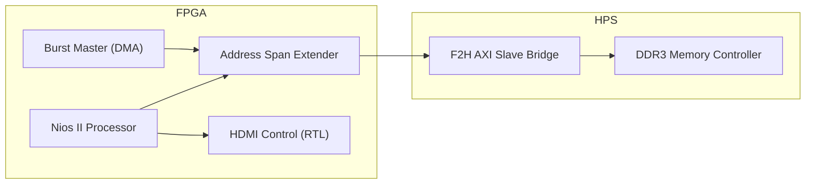

# DE10-Nano 비디오 프로세싱 프로젝트
[**English**](./README.md) | [**한국어**]

## 📌 프로젝트 개요
본 프로젝트는 DE10-Nano (Cyclone V SoC) 플랫폼에서 FPGA와 HPS DDR3 메모리 간의 고성능 비디오 데이터 이동을 구현합니다.
**FPGA-to-HPS AXI Bridge**를 활용함으로써 일반적인 프리로더/브릿지 잠금 문제를 우회하고, 실시간 비디오 처리에 적합한 안정적인 고속 DMA 액세스를 달성했습니다.

## 🚀 주요 성과
- **DDR3 연결성 확보**: 메모리 액세스 경로를 잠겨 있는 SDRAM 포트에서 AXI 브릿지로 재배치하여 시스템 행(Hang) 문제를 성공적으로 해결했습니다.
- **하드웨어 DMA 마스터**: 고속 데이터 전송을 수행하기 위해 커스텀 `burst_master` (Avalon-MM)를 통합했습니다.
- **성능 최적화**: 소프트웨어 기반 복사 루프 대비 하드웨어 구동 버스트를 사용하여 약 30배의 처리량 향상을 달성했습니다.
- **안정적인 데이터 일관성**: Nios II와 하드웨어 마스터 간에 공유되는 데이터의 신뢰성을 위해 적절한 캐시 관리(`alt_dcache_flush_all`)를 구현했습니다.
- **비디오 파이프라인 최적화**: SDC에서 비동기 클록 그룹 제약 조건을 적용하여 타이밍 위반(Negative Slack -6.5ns) 문제를 해결했습니다.
- **고급 HDMI 제어**: 정교한 감마 보정(sRGB, Inverse Gamma 2.2) 및 커스텀 캐릭터 타일 렌더링(Mode 7)을 구현했습니다.
- **안정적인 주소 매핑**: Avalon-MM의 바이트-워드 주소 지정 문제를 수정하여 신뢰할 수 있는 레지스터 제어를 보장했습니다.

### 🎬 비디오 재생 (신규!)
- **qHD 해상도 (960×540@60Hz)**: 50MHz 버스 대역폭에 최적화 (가용 200 MB/s 중 124 MB/s 사용)
- **정적 이미지 디스플레이**: Nios II 소프트웨어가 DDR3에서 이미지를 로드하고 표시합니다.
- **리눅스 비디오 재생**: 고성능 "Store-and-Forward" 아키텍처 (RAM Preload) 구현.
- **네트워크 스트리밍**: SSH를 통해 호스트 PC로부터 비디오를 파이핑하는 기능 지원 (`cat | ssh`).
- **듀얼 클록 아키텍처**: CSR(50MHz)과 Pixel(37.8MHz) 클록을 분리하고 적절한 CDC를 적용했습니다.
- **V-Sync 동기화**: 하드웨어 래칭을 통한 티어링 없는(Tear-free) 프레임 업데이트를 구현했습니다.

## 🏗 시스템 아키텍처

## 성능 요약

| 데이터 경로 | 방법 | 처리량 | 검증 |
| :--- | :--- | :--- | :--- |
| **OCM to DDR3** | 소프트웨어 복사 (CPU) | 4.55 MB/s | 기준점(Baseline) |
| | **하드웨어 DMA (버스트)** | **136.53 MB/s** | **약 30배 향상** |
| **DDR3 to DDR3** | 소프트웨어 (산술 연산 포함) | 0.21 MB/s | 참조용 |
| | **하드웨어 DMA (BM4/파이프라인)** | **125.00 MB/s** | **약 585배 향상** |

## 🧪 검증 (Cocotb)
하드웨어 배치 전 비디오 파이프라인을 엄격하게 검증하기 위해 **Cocotb**를 활용하여 비트 단위 정확도(Bit-accurate) 검증을 수행했습니다. 이 프로세스는 실제 하드웨어 환경을 시뮬레이션하고 출력 결과를 참조 이미지와 픽셀 단위로 비교합니다.

### 🔍 검증 프로세스 (단계별)
1. **이미지 사전 로드 (`image.raw`)**:
   - Python 테스트벤치(`tb_video_integration.py`)가 원본 바이너리 이미지 파일을 읽어 **DDR3 메모리 모델**에 사전 로드합니다.
   - 이는 비디오 프레임이 물리 메모리에 이미 준비되어 있는 리눅스 환경을 효과적으로 시뮬레이션합니다.

2. **RTL 시뮬레이션 실행**:
   - FPGA RTL 코어(`video_dma_master`, `fifo`, `pipeline`)가 메모리 모델로부터 데이터를 가져오기 위해 DMA 트랜잭션을 시작합니다.
   - 데이터는 처리 파이프라인을 거쳐 엄격한 HDMI 타이밍 규격에 따라 전송됩니다.

3. **출력 캡처 (`hdmi_output.bin`)**:
   - 테스트벤치는 HDMI 출력 신호(`hdmi_de`, `hdmi_d`)를 모니터링하고, 활성 비디오 구간 동안 유효한 픽셀 데이터를 바이너리 파일(`hdmi_output.bin`)로 캡치합니다.

4. **자동 무결성 검사 (`bin2bmp.py`)**:
   - 시뮬레이션 후속 스크립트가 **캡처된 출력**과 **원본 입력**을 비교하여 데이터 무결성을 검증합니다.
   - 통과 조건: 960x540 프레임의 모든 픽셀에 대해 **비트 단위로 완벽하게 일치**해야 합니다.

> **참고**: 이러한 엄격한 검증 워크플로우를 통해 하드웨어 합성 전에 FIFO 오버플로우 및 CDC(클록 도메인 교차) 오류와 같은 치명적인 문제를 식별하고 해결할 수 있었습니다.

## 📖 문서
- [VIDEO_PLAYBACK.md](doc/VIDEO_PLAYBACK.md) | [국문](doc/VIDEO_PLAYBACK_kor.md): **⭐ 신규** - qHD 비디오 재생 구현, 리눅스 통합 및 성능 분석.
- [DESIGN.md](doc/DESIGN.md) | [국문](doc/DESIGN_kor.md): 전체 시스템 아키텍처 및 DDR-to-HDMI 파이프라인 사양.
- [NIOS.md](doc/NIOS.md) | [국문](doc/NIOS_kor.md): 상세 인터랙티브 메뉴 트리 구조 및 제어 로직.
- [BURST_DMA.md](doc/BURST_DMA.md) | [국문](doc/BURST_DMA_kor.md): 상세 디버깅 이력, 성능 벤치마크 및 메모리 보호 전략.
- [STUDY.md](doc/STUDY.md) | [국문](doc/STUDY_kor.md): HDMI 타이밍, ADV7513 및 비디오 처리에 관한 기술 학습 노트.
- [RESULT.md](doc/RESULT.md) | [국문](doc/RESULT_kor.md): 공식 성능 벤치마크 결과 및 하드웨어 상태 로그.
- [TRYERROR.md](./TRYERROR.md) | [국문](./TRYERROR_kor.md): **⭐ 신규** - DMA, FIFO 및 HDMI 통합 과정에서의 문제 해결 기록.
- [TODO.md](doc/TODO.md) | [국문](doc/TODO_kor.md): 프로젝트 로드맵 및 남은 과제.
- [soc_system.qsys](./soc_system.qsys): Platform Designer (Qsys) 하드웨어 구성.
- [nios_software/](./nios_software/): Nios II 벤치마크 및 검증 소스 코드.
- [linux_software/](./linux_software/): 비디오 재생을 위한 리눅스 HPS 애플리케이션.
