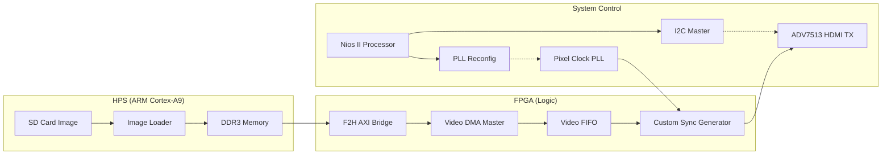

# Design Specification: HDMI Video Pipeline
[**English**] | [**한국어**](./DESIGN_kor.md)
[⬅️ Back to README](../README.md)
 Specification

This document outlines the architecture and technical design for streaming video data from HPS DDR3 memory to the HDMI display interface on the DE10-Nano platform.

## 1. System Architecture & Data Flow

Video data is transferred through a high-bandwidth path to ensure real-time performance:
**SD Card (ARM/Linux) ➡️ DDR3 Memory ➡️ Video DMA (FPGA) ➡️ HDMI TX (ADV7513)**

---

## 2. Component Responsibilities

### HPS (ARM/Linux Core)
- **Data Acquisition**: Transfers image/video sources from the SD card to the Linux filesystem via SCP.
- **Memory Mapping**: Maps the DDR3 memory to user space and writes pixel data to a predefined reserved region (e.g., 32MB Offset).
- **High Bandwidth**: Leverages the FPGA-to-HPS AXI bridge for efficient data sharing between ARM and FPGA logic.

### Nios II Processor (Control Layer)
- **Peripheral Configuration**: Initializes the ADV7513 HDMI Transmitter registers via the I2C Master (Power management, Color format configuration, etc.).
- **Dynamic Resolution Control**: Manages the `Altera PLL Reconfig` IP to dynamically switch pixel clocks (e.g., 25.2MHz for 480p, 74.25MHz for 720p).
- **Pipeline Orchestration**: Triggers the Video DMA and monitors the overall system status.

### FPGA Fabric (High-Speed Data Path)
- **Video DMA Master (MM2ST)**: A custom DMA module that fetches pixel data from DDR3 via an **Avalon-MM Master** and outputs it as a high-speed **Avalon-ST (Streaming)** source.
- **Custom Sync Generator**: A Verilog module that converts streaming pixel data into standard HDMI timing signals (HSync, VSync, Data Enable) based on the target resolution.
- **Latency Optimization**: Bypasses traditional bottlenecks by using the F2H AXI Slave Bridge, ensuring a stable throughput of over 100MB/s.

---

## 3. Technical Design Choices

1. **ARM-based Data Loading**: We chose ARM-Linux for data loading over JTAG (HostFS) because it provides significantly higher transfer speeds required for video.
2. **Software-Defined Control (Nios II)**: Implementing I2C and PLL reconfiguration in software provides the flexibility to support multiple display resolutions and timing adjustments without rebuilding the hardware.
3. **Direct AXI Connectivity**: The Video DMA connects directly to the F2H AXI Slave Bridge. This removes the need for the Address Span Extender in the high-speed data path, reducing latency and simplifying the address mapping to a direct physical view of the HPS DDR3.

---

## 4. Implementation Roadmap

1. **Qsys Hardware Integration**: Add and connect PLL Reconfig, I2C Master, Video DMA, and CVO IPs.
2. **Top-level RTL Integration**: Wire the Qsys system ports to the physical HDMI output pins.
3. **Nios II Driver Development**: Implement the ADV7513 I2C driver and PLL control API.
4. **ARM Image Loader**: Develop a Linux-side utility to push image buffers into DDR3.
5. **System Validation**: Verify timing across different resolutions and perform the final display test.
