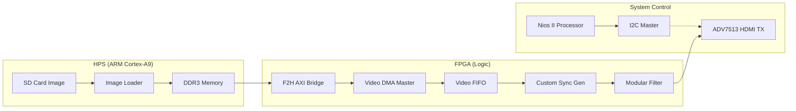
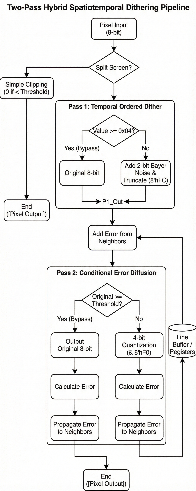

# Design Specification: HDMI Video Pipeline
[⬅️ Back to README](../README.md)
 Specification

This document outlines the architecture and technical design for streaming video data from HPS DDR3 memory to the HDMI display interface on the DE10-Nano platform.

## 1. System Architecture & Data Flow

Video data is transferred through a high-bandwidth path to ensure real-time performance:
**SD Card (ARM/Linux) ➡️ DDR3 Memory ➡️ Video DMA (FPGA) ➡️ Filter Pipeline ➡️ HDMI TX (ADV7513)**

```mermaid
graph LR
    subgraph "HPS (ARM Cortex-A9)"
        SD[SD Card Image] --> SW_Load[Image Loader]
        SW_Load --> DDR[DDR3 Memory]
    end

    subgraph "FPGA (Logic)"
        DDR --> AXI[F2H AXI Bridge]
        AXI --> V_DMA[Video DMA Master]
        V_DMA --> FIFO[Video FIFO]
        FIFO --> SGEN[Custom Sync Gen]
        SGEN --> FLT[Modular Filter]
    end

    subgraph "System Control"
        Nios[Nios II Processor]
        Nios --> I2C[I2C Master]
        I2C -.-> HDMI_Chip[ADV7513 HDMI TX]
    end

    FLT --> HDMI_Chip
```

---

## 2. Component Responsibilities

### HPS (ARM/Linux Core)
- **Data Acquisition**: Transfers sources from the SD card to Linux.
- **RAM Preload**: Implements a preload buffer to overcome SD card bandwidth limits (90MB/s required for 540p@60fps).

### Nios II Processor (Control Layer)
- **Modular Filter Control**: Manages a 4-bit `filter_mode` CSR to switch between 16 possible filter algorithms in real-time.
- **Peripheral Configuration**: Initializes the ADV7513 HDMI Transmitter via I2C.

### FPGA Fabric (High-Speed Data Path)
- **Image Filter Pipeline**: 
    - **Line Buffers**: Utilizes dual line buffers to maintain 3 rows of pixel data in on-chip SRAM.
    - **3x3 Windowing**: Generates a spatial window for convolution operations (Blur, Edge, Sharpen, Emboss).
    - **Point Processing**: Coordinates-based real-time filters.
    - **2-Stage Hybrid Spatiotemporal Dithering (Mode 8)**:
        - **Stage 1 (Pass 1): Temporal Ordered Dither**: Applies a 2-bit Bayer noise seed to the LSBs. If the pixel value is above `0x04`, it is bypassed to maintain high-frequency detail.
        - **Stage 2 (Pass 2): Conditional Error Diffusion**: Implements Floyd-Steinberg diffusion with a user-configurable threshold. 
        - **Energy Conservation**: Even when a pixel is bypassed (Value > Threshold), errors from neighboring pixels are accumulated and propagated to ensure seamless transitions.
        - **Architecture**: Operates entirely on-chip using a single 960-word BRAM line buffer (M10K) to eliminate external frame buffer overhead.

    - **Split-Screen Support**: Supports a real-time split-screen mode (x < 480) to compare clean (simple truncation) against processed output.

    - **Parallel Processing**: Computes all filters (Bypass, Blur, Edge, Emboss, Sharpen, Dither) in parallel, with a perfectly matched 3-clock pipeline delay.
- **Video DMA Master**: Fetches pixel data from DDR3 via Avalon-MM.

---

## 3. Technical Design Choices

1. **Modular Filter Architecture**: Decoupling the filter logic into submodules (`filter_blur`, `filter_edge`, etc.) allows for independent verification and easy expansion of effects.
2. **Fixed-Point Arithmetic**: Used for kernel convolutions to avoid the resource cost of floating-point units while maintaining visual quality.
3. **Synchronous 540p Timing**: Standardized on 960x540p to maximize throughput while staying within the DE10-Nano's pixel clock limits.
4. **Hybrid Dithering strategy**: Decouples the spatiotemporal process into a memory-less temporal domain (Pass 1) and a single-line-buffered spatial domain (Pass 2), achieving premium visual character with zero external memory bandwidth overhead.

---

## 4. Clock Domain Crossing (CDC) Design

The system operates across two primary clock domains. Proper synchronization is implemented to prevent metastability and ensuring data integrity.

### 4.1 Clock Domains
| Clock Name | Frequency | Responsibility |
|------------|-----------|----------------|
| `clk_50`   | 50 MHz    | System Clock, CSR Interface, DMA Master, FIFO Write |
| `clk_hdmi` | 37.8 MHz  | Pixel Clock, Sync Gen, Image Filters, FIFO Read |

### 4.2 Synchronization Mechanisms

The following 5 paths manage data and control flow across domains:

1.  **Video Data Path (50MHz → 37.8MHz)**:
    - **Mechanism**: Asynchronous FIFO (`DC_FIFO`).
    - **Implementation**: Uses Gray-coded pointers for safe crossing of read/write pointers across domains. The FIFO handles internal synchronization and timing closure.
2.  **V-Sync Edge Detection (37.8MHz → 50MHz)**:
    - **Mechanism**: Toggle-Synchronizer + Edge Detect.
    - **Implementation**: `vs_toggle` in the Pixel domain toggles on every V-Sync. In the 50MHz domain, it is sampled through a 3-stage shift register (`vsync_toggle_sync_50`). An **XOR** of stages [2] and [1] extracts the edge.
    - **Why XOR?**: Detects any transition (0→1 or 1→0) of the toggled signal, ensuring short pulses aren't missed by a slower clock.
3.  **CSR Status Synchronization (37.8MHz → 50MHz)**:
    - **Mechanism**: Multi-stage (Dual-flop) Synchronizer.
    - **Implementation**: The `vs_toggle` signal is sampled into a 2-stage register (`vs_toggle_sync`) in `hdmi_sync_gen.v` so the Nios II can safely read the V-Sync status via the Avalon-MM interface.
4.  **Frame Pointer Snap (37.8MHz → 50MHz)**:
    - **Mechanism**: Pulse Synchronizer (Edge Detect).
    - **Implementation**: The internal `vs_wire` (Pixel domain) is sampled into a 3-stage register (`vs_sync_sh`) in the 50MHz domain. On the rising edge of the synchronized signal, `reg_frame_ptr` is latched into `shadow_ptr` to ensure a stable address for the next frame.
5.  **Steady-State Control Signals (50MHz → 37.8MHz)**:
    - **Mechanism**: Direct sampling.
    - **Implementation**: Signals like `reg_mode` and `reg_global_ctrl[0]` (Gamma) are "quasi-static" (changed only via software and stable for millions of clock cycles). They are sampled directly in the `clk_hdmi` domain.

---

## 5. Final Verification
1. **RTL Simulation (Cocotb)**: Cycle-accurate verification using real `.raw` image data.
2. **Target Hardware**: Verified stable 60fps output on HDMI monitors.
