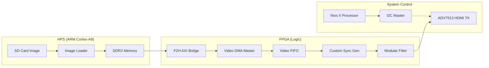

# Design Specification: HDMI Video Pipeline
[⬅️ Back to README](../README.md)
 Specification

This document outlines the architecture and technical design for streaming video data from HPS DDR3 memory to the HDMI display interface on the DE10-Nano platform.

## 1. System Architecture & Data Flow

Video data is transferred through a high-bandwidth path to ensure real-time performance:
**SD Card (ARM/Linux) ➡️ DDR3 Memory ➡️ Video DMA (FPGA) ➡️ Filter Pipeline ➡️ HDMI TX (ADV7513)**

```mermaid
graph LR
    subgraph "HPS (ARM Cortex-A9)"
        SD[SD Card Image] --> SW_Load[Image Loader]
        SW_Load --> DDR[DDR3 Memory]
    end

    subgraph "FPGA (Logic)"
        DDR --> AXI[F2H AXI Bridge]
        AXI --> V_DMA[Video DMA Master]
        V_DMA --> FIFO[Video FIFO]
        FIFO --> SGEN[Custom Sync Gen]
        SGEN --> FLT[Modular Filter]
    end

    subgraph "System Control"
        Nios[Nios II Processor]
        Nios --> I2C[I2C Master]
        I2C -.-> HDMI_Chip[ADV7513 HDMI TX]
    end

    FLT --> HDMI_Chip
```

---

## 2. Component Responsibilities

### HPS (ARM/Linux Core)
- **Data Acquisition**: Transfers sources from the SD card to Linux.
- **RAM Preload**: Implements a preload buffer to overcome SD card bandwidth limits (90MB/s required for 540p@60fps).

### Nios II Processor (Control Layer)
- **Modular Filter Control**: Manages a 4-bit `filter_mode` CSR to switch between 16 possible filter algorithms in real-time.
- **Peripheral Configuration**: Initializes the ADV7513 HDMI Transmitter via I2C.

### FPGA Fabric (High-Speed Data Path)
- **Image Filter Pipeline**: 
    - **Line Buffers**: Utilizes dual line buffers to maintain 3 rows of pixel data in on-chip SRAM.
    - **3x3 Windowing**: Generates a spatial window for convolution operations.
    - **Parallel Processing**: Computes Blur, Edge, Emboss, and Sharpen in parallel, with a matched 3-clock pipeline delay.
- **Video DMA Master**: Fetches pixel data from DDR3 via Avalon-MM.

---

## 3. Technical Design Choices

1. **Modular Filter Architecture**: Decoupling the filter logic into submodules (`filter_blur`, `filter_edge`, etc.) allows for independent verification and easy expansion of effects.
2. **Fixed-Point Arithmetic**: Used for kernel convolutions to avoid the resource cost of floating-point units while maintaining visual quality.
3. **Synchronous 540p Timing**: Standardized on 960x540p to maximize throughput while staying within the DE10-Nano's pixel clock limits.

---

## 4. Final Verification
1. **RTL Simulation (Cocotb)**: Cycle-accurate verification using real `.raw` image data.
2. **Target Hardware**: Verified stable 60fps output on HDMI monitors.
