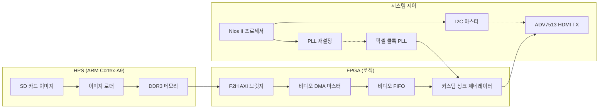

# 설계 사양: HDMI 비디오 파이프라인
[**English**](./DESIGN.md) | [**한국어**]
[⬅️ README로 돌아가기](../README_kor.md)

이 문서는 DE10-Nano 플랫폼에서 HPS DDR3 메모리로부터 HDMI 디스플레이 인터페이스로 비디오 데이터를 스트리밍하기 위한 아키텍처 및 기술 설계를 설명합니다.

## 1. 시스템 아키텍처 및 데이터 흐름

실시간 성능을 보장하기 위해 비디오 데이터는 고대역폭 경로를 통해 전송됩니다:
**SD 카드 (ARM/리눅스) ➡️ DDR3 메모리 ➡️ 비디오 DMA (FPGA) ➡️ HDMI TX (ADV7513)**

---

## 2. 구성 요소별 역할

### HPS (ARM/리눅스 코어)
- **데이터 획득**: SCP를 통해 SD 카드로부터 이미지/비디오 소스를 리눅스 파일 시스템으로 전송합니다.
- **메모리 매핑**: DDR3 메모리를 사용자 공간에 매핑하고, 미리 정의된 예약 영역(예: 32MB 오프셋)에 픽셀 데이터를 씁니다.
- **고대역폭**: ARM과 FPGA 로직 간의 효율적인 데이터 공유를 위해 FPGA-to-HPS AXI 브릿지를 활용합니다.

### Nios II 프로세서 (제어 계층)
- **주변 장치 구성**: I2C 마스터를 통해 ADV7513 HDMI 트랜스미터 레지스터를 초기화합니다 (전원 관리, 컬러 포맷 설정 등).
- **동적 해상도 제어**: `Altera PLL Reconfig` IP를 관리하여 픽셀 클록을 동적으로 전환합니다 (예: 480p의 경우 25.2MHz, 720p의 경우 74.25MHz).
- **파이프라인 오케스트레이션**: 비디오 DMA를 트리거하고 전체 시스템 상태를 모니터링합니다.

### FPGA 패브릭 (고속 데이터 경로)
- **비디오 DMA 마스터 (MM2ST)**: **Avalon-MM 마스터**를 통해 DDR3에서 픽셀 데이터를 가져와 고속 **Avalon-ST (스트리밍)** 소스로 출력하는 커스텀 DMA 모듈입니다.
- **커스텀 싱크 제네레이터**: 스트리밍 픽셀 데이터를 대상 해상도에 따른 표준 HDMI 타이밍 신호(HSync, VSync, Data Enable)로 변환하는 Verilog 모듈입니다.
- **지연 시간 최적화**: F2H AXI 슬레이브 브릿지를 사용하여 기존의 병목 현상을 우회하고 100MB/s 이상의 안정적인 처리량을 보장합니다.

---

## 3. 기술적 설계 결정 사항

1. **ARM 기반 데이터 로딩**: JTAG(HostFS) 대비 비디오 재생에 필요한 훨씬 더 높은 전송 속도를 제공하는 ARM-리눅스 기반 로딩 방식을 선택했습니다.
2. **소프트웨어 정의 제어 (Nios II)**: I2C 및 PLL 재구성을 소프트웨어로 구현함으로써, 하드웨어를 재구축하지 않고도 다양한 디스플레이 해상도와 타이밍 조정을 지원할 수 있는 유연성을 확보했습니다.
3. **직접 AXI 연결**: 비디오 DMA가 F2H AXI 슬레이브 브릿지에 직접 연결됩니다. 이를 통해 고속 데이터 경로에서 Address Span Extender의 필요성을 제거하여 지연 시간을 줄이고 HPS DDR3의 물리적 주소 매핑을 간소화했습니다.

---

## 4. 구현 로드맵

1. **Qsys 하드웨어 통합**: PLL Reconfig, I2C Master, Video DMA 및 CVO IP를 추가하고 연결합니다.
2. **최상위 RTL 통합**: Qsys 시스템 포트와 물리적 HDMI 출력 핀을 연결합니다.
3. **Nios II 드라이버 개발**: ADV7513 I2C 드라이버 및 PLL 제어 API를 구현합니다.
4. **ARM 이미지 로더**: 이미지 버퍼를 DDR3로 전송하기 위한 리눅스 측 유틸리티를 개발합니다.
5. **시스템 검증**: 다양한 해상도에 대해 타이밍을 확인하고 최종 디스플레이 테스트를 수행합니다.
