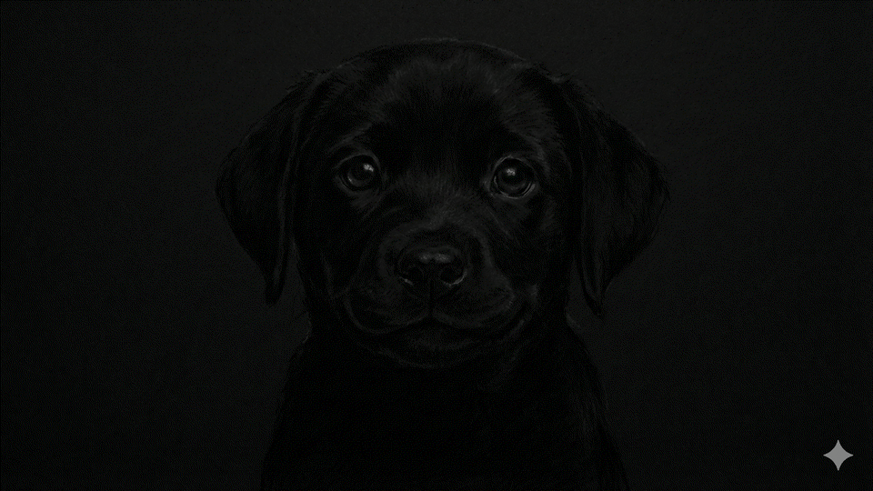

# Advanced Dithering: Breaking the Color Depth Barrier

When compressing high-resolution color data (e.g., 24-bit RGB, where each channel is 8-bit) to a lower bit depth (e.g., 12-bit RGB, where each channel is 4-bit), simple truncation results in severe **"Color Banding"**. This manifests as harsh, visible steps in smooth gradients. To preserve the perception of continuous gradations and higher color depth on limited hardware, we employ **Dithering**.

---

## 1. The Core Concept: Ordered Dithering

Instead of simply truncating the bottom bits of a pixel's color value, dithering selectively adds structured noise to the pixel *before* truncation. 

### The Bayer Matrix
For Ordered Dithering, we use a predefined pattern matrix, typically a $4\times4$ **Bayer Matrix**. This matrix contains values uniformly distributed from $0$ to $15$ ($2^4 - 1$).

```
Bayer Matrix (4x4):
[  0,  8,  2, 10 ]
[ 12,  4, 14,  6 ]
[  3, 11,  1,  9 ]
[ 15,  7, 13,  5 ]
```

### The Math
The mathematical operation per pixel at coordinate $(x, y)$ is:
```verilog
Noise_Value = Bayer_Matrix[y % 4][x % 4]
Pixel_Out = (Pixel_In + Noise_Value) & 0xF0  // Truncate lower 4 bits
```

### Why It Works
By intentionally adding a small amount of noise, pixels that are mathematically "close" to the next 4-bit threshold will occasionally be pushed over the edge into the brighter value. Because the Bayer matrix is designed to scatter high and low values evenly, your eye naturally acts as a "low-pass filter," averaging the dots together geographically to perceive the missing intermediate colors.

---

## 2. Implementation Nuances: True vs. Standard

### The "Standard" (Flawed) Approach
Many simple implementations try to be clever by conditionally applying dithering. For example, they might only apply noise if the pixel is above a certain threshold, or they might clip the addition to prevent overflow before truncation. 
- **The Problem**: This often creates a visible, artificial boundary (a 'noise wall') between very dark areas (which remain un-dithered) and slightly brighter areas (where dithering abruptly starts).

### True Ordered Dithering
To achieve perfect gradients, you **must** apply the noise mathematically to *all* pixels, and *then* truncate. 
- **The Caveat**: If you apply noise to absolute black `0x00`, the matrix will occasionally bump it up to `0x10`, causing your true blacks to emit a faint glowing grid.
- **The Solution**: In our implementation, we assume that output values below `0x10` effectively do not emit light on the target display. Therefore, we **bypass** the dithering addition strictly for input pixels `< 0x10`. Everything else is flawlessly dithered, preventing artificial boundaries while preserving pure blacks.

---

## 3. Advanced Perceptual Enhancements

A static $4\times4$ Bayer matrix applied naively creates a noticeable "screen-door effect" (a fixed, static grid pattern on the screen). To elevate the quality to a professional level, we implemented two critical enhancements to trick the human visual system.

### Enhancement A: Temporal Scrambling (Film Grain)
Instead of keeping the Bayer grid locked to the exact same screen coordinates on every frame, we scramble it over time.

- **The Problem with Simple Scrolling**: Moving the matrix $X+1, Y+1$ every frame creates a visible, distracting "scrolling" or "raining" artifact across the screen.
- **2D Scrambling Solution**: We use a 4-bit frame counter, giving us 16 distinct frames. We bit-scramble the counter outputs into our X and Y spatial offsets:
  ```verilog
  X_offset = {frame_cnt[0], frame_cnt[2]}
  Y_offset = {frame_cnt[1], frame_cnt[3]}
  ```
- **The Result**: The matrix jumps pseudo-randomly across all 16 possible starting positions. Because it hits every position exactly once every 16 frames, the average brightness perfectly mathematically integrates over time. Structurally, the static pattern noise is transformed into uncorrelated, highly pleasing **"Film Grain."**

### Enhancement B: RGB Channel Decorrelation
If you apply the *exact same* Bayer noise value to the Red, Green, and Blue channels of a single pixel simultaneously, you are exclusively fluctuating the pixel's **Luminance** (overall brightness).
- **The Problem**: The human eye is incredibly sensitive to high-frequency variations in Luminance. This makes the black/white Bayer grid dots very harsh and contrasty.
- **The Solution (Decorrelation)**: We read the exact same Bayer matrix, but from slightly different starting spatial coordinates for each color channel!
    - **Red**: No offset ($X, Y$)
    - **Green**: Offset ($X+1, Y+2$)
    - **Blue**: Offset ($X+2, Y+1$)
- **The Result**: The noise is pushed almost entirely into the **Chrominance** (Color) domain. Human eyes are very insensitive to high-frequency chroma noise. By "decorrelating" the channels, the harsh Luma grid completely dissolves into a uniform, soft scatter. The perceived image quality is significantly higher, appearing closer to a high-bit-depth display.

---

## 4. Final Architecture: 2-Stage Hybrid Spatiotemporal Dithering

To achieve the best possible quality while respecting hardware limits (zero external memory), we implemented a **2-Stage Hybrid Pipeline** that combines the strengths of both Ordered Dithering and Error Diffusion.

1. **Pass 1 (Temporal Ordered Dither)**: 
   - Applies a 2-bit temporally scrambled Bayer matrix strictly to ultra-dark areas (`< 0x04`). 
   - This injects high-frequency dynamic noise (film grain) that breaks up static spatial structures.
2. **Pass 2 (Conditional Error Diffusion)**: 
   - Implements a **Floyd-Steinberg** algorithm using a single BRAM line buffer.
   - It calculates the exact mathematical quantization error and diffuses it to neighboring pixels ($7/16, 3/16, 5/16, 1/16$).
   - **Seamless Error Propagation**: Even when a pixel is bypassed (Value > Threshold), errors from neighboring pixels are still accumulated and propagated, ensuring perfect energy conservation across boundaries.

### Visual Comparison

To demonstrate the power of this hybrid approach, we simulated a display with severe bit-depth limitations:

- **Original (24-bit)**:
  

- **Hard Clamped (4-bit, No Dither)**:
  

- **2-Stage Hybrid Result (Temporal + FS Error Diffusion)**:
  

Notice how the **Hard Clamped** image suffers from severe black crush and banding. In the **Hybrid** result, the background gradients are smooth, and the shadow details in the fur are fully recovered through the interaction of temporal noise and spatial diffusion.

### Scientific Proof: PSNR Improvement
Our quantitative analysis shows that the 2-Stage Hybrid architecture achieves a **+3.30 dB improvement in PSNR** compared to simple truncation, proving its effectiveness in high-fidelity image restoration for low-grayscale displays.

*(See `DESIGN.md` for detailed RTL hardware architecture and timing diagrams).*

