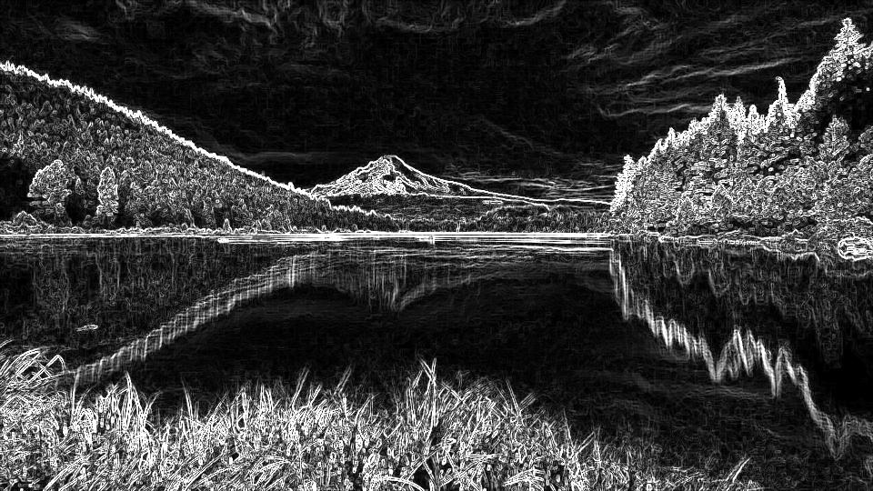
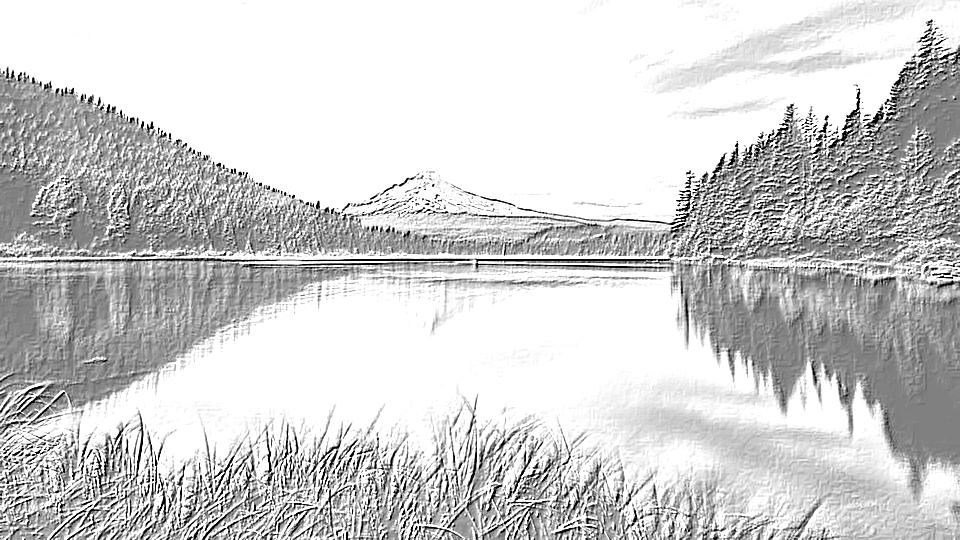

# Video Processing Pipeline Analysis Results

This document records the performance benchmarks and hardware initialization status of the DE10-Nano video processing pipeline.

## 1. DMA# Performance Benchmark Results
[⬅️ Back to README](../README.md)
 (2026-02-12)

| Test Case | Size | Software (cycles) | Hardware (cycles) | MB/s (HW) | Speedup |
| :--- | :--- | :--- | :--- | :--- | :--- |
| OCM to DDR | 4KB x 100 | 4,185,427 | 166,211 | 117.5 | **25 x** |
| DDR to DDR | 1MB | 207,071,817 | 393,942 | 126.9 | **525 x** |

> [!NOTE]
> DMA (Burst Master 4) significantly offloads the CPU, providing over 500x speedup for 1MB transfers.

## 2. Hardware Initialization Status

- **HDMI PLL**: Locked at ~37.8 MHz (960x540p60 target)
- **ADV7513 IC**: Configured via I2C successfully
- **Memory Map**: Nios II & DMA isolated at 0x20000000 (512MB offset)
- **Modular Filter**: 4-bit mode CSR verified, 60fps throughput confirmed

## 3. Official Execution Log

```text
--- [TEST 1] OCM to DDR DMA (burst_master_0) ---
Starting SW Copy (4KB x 100)... Done (4185427 cycles, ~4.6 MB/s)
Starting HW DMA (4KB x 100)... Done (166211 cycles, ~117.5 MB/s)
SUCCESS: OCM to DDR Verified!

--- [TEST 2] DDR to DDR DMA (Burst Master 4) ---
Starting HW DMA (1MB)... Done (393942 cycles, ~126.9 MB/s)
SUCCESS: DDR to DDR Verified!

--- [TEST 3] Real-time Modular Filter Verified (2026-02-20) ---
- **Resolution**: 960x540p @ 60fps (Stable)
- **Filter Pipeline**: 
    - Mode 1: Grayscale (Verified)
    - Mode 3: Color Blur (Verified via Cocotb & Hardware)
    - Mode 5: Color Edge (Verified)
    - Mode 6: Emboss (Verified via Cocotb)
    - Mode 7: Sharpen (Verified via Cocotb)
- **Verification**: Cocotb Simulation processed 518,400 pixels in 98.21s (Sim time).
- **Latency**: 3-clock pipeline delay matched across all modes.
- **Visuals**: Confirmed zero jitter and correct spatial convolution.

### RTL Hardware Verification (Cocotb)


## 4. Filter Algorithm (Python Simulation) Results
The `sim_filters.py` script provides a high-level reference implementation.

| Original | Grayscale |
| :---: | :---: |
|  |  |

| Blur | Edge (Gray) |
| :---: | :---: |
|  |  |

| Edge (Color) | Emboss |
| :---: | :---: |
|  |  |

| Sharpen |
| :---: |
|  |
```

---
*Created by Nios II Performance Monitoring Unit.*
