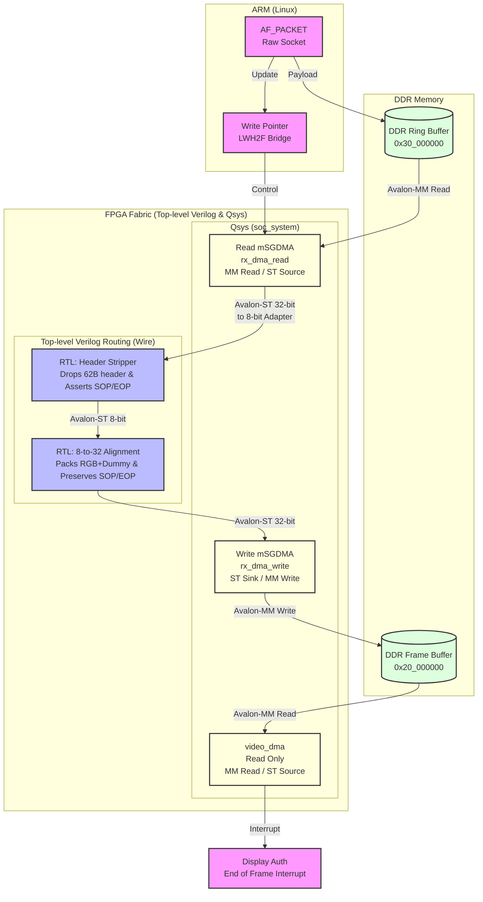

# ST 2110 Hybrid Hardware Receiver Implementation Roadmap

This document outlines the 5-phase strategic roadmap for implementing a Hybrid ST 2110 Hardware Receiver on the DE10-Nano platform. The methodology progresses systematically from software-level packet verification to full hardware integration. Each phase defines specific implementation tasks and objective verification criteria to minimize debugging scope and ensure system stability.

---

## Phase 1: Network Packet Acquisition and Verification (PC Transmitter & ARM Raw Socket)

The initial phase focuses on establishing a baseline for network communication and verifying the exact structure of the incoming 62-byte packet header (Ethernet + IP + UDP + RTP + SRD). Hardware integration is deferred to later phases.

*   **Task 1 (PC Transmitter):** Develop a Python script or GStreamer pipeline on the host PC to encapsulate a 960x540 resolution test pattern into the SMPTE ST 2110-20 standard format and transmit it to the DE10-Nano via Gigabit Ethernet.
*   **Task 2 (ARM Receiver):** Implement a C/C++ application on the DE10-Nano Linux environment utilizing `AF_PACKET` (Raw Sockets) to capture the raw electrical-level data frames received by the network interface.
*   **✅ Verification Point:** Print the first 62 bytes of the captured packet in hexadecimal format via the ARM terminal. Success is defined by accurately matching the host PC's MAC address and the expected RTP/SRD header values.

---

## Phase 2: Zero-Copy Memory Management (DDR Ring Buffer & mmap)

This phase implements a zero-copy memory architecture to efficiently transfer network packets from the ARM processor to a shared memory space accessible by the FPGA.

*   **Task 1 (ARM Memory Allocation):** Utilize the `mmap` system call to allocate a physical DDR memory address range outside the Linux kernel space (e.g., `0x3000_0000`). This region will act as a shared **Ring Buffer**.
*   **Task 2 (Data Transfer & Synchronization):** Use `memcpy` to write the payload received from the Raw Socket into the Ring Buffer. Concurrently, update a dedicated Avalon-MM register with the **Write Pointer** to notify the FPGA logic of the available data range.
*   **✅ Verification Point:** Inspect the physical DDR address using the Linux `devmem` utility. Success is defined by visually confirming the successful continuous write of the ST 2110 packet payload into the designated physical memory locations.

---

## Phase 3 & 4: Hardware Data Pipeline Configuration & RTL Integration

This phase establishes the hardware data paths (conveyor belt) necessary to transport the buffered data from the DDR memory, strip the headers, align the 32-bit pixel data, and write it back to the display frame buffer.

### 🏗 Hardware Pipeline Architecture (Top-Level & Qsys 통합 최종안)

Qsys 내부에서 모든 모듈을 조립하면 수정 시 번거롭고 빌드 시간이 길어지는 단점이 있습니다.
따라서 **Qsys에는 오직 2개의 '깡통 DMA'만 배치하여 스트림 인터페이스를 외부로 뽑아내고, 실질적인 RTL 연산 모듈들(가위, 포장기)은 Top-level Verilog에서 wire로 조립**하는 "실무 최적화 방식"을 채택합니다.



### 📋 Phase 3/4 Implementation Tasks

*   **Task 1 (RTL Development):** Implement `st2110_header_stripper.v` to drop exactly 62 bytes and parse RTP Marker / SRD logic for VSync (SOP/EOP) generation. **(Completed)**
*   **Task 2 (RTL Alignment):** Implement `st2110_alignment_wrapper.v` to pack 8-bit video data into the 32-bit Avalon-ST format required by the Video DMA. **(Completed)**
*   **Task 3 (Qsys Integration):** 
    *   Instantiate `mSGDMA` (Memory-Mapped to Streaming) explicitly as `rx_dma_read` reading from 0x3000_0000.
    *   Instantiate `mSGDMA` (Streaming to Memory-Mapped) explicitly as `rx_dma_write` writing to 0x2000_0000.
    *   Export the Avalon-ST Sink/Source interfaces of both DMAs to the Top-level.
*   **Task 4 (Top-level Routing):** In `DE10_NANO_SoC_GHRD.v`, instantiate the two RTL modules and wire them between the exported `rx_dma_read` and `rx_dma_write` ports.
*   **✅ Verification Point:** Successfully generate the Qsys system without errors and complete full hardware compilation (Bitstream generation) in Quartus Prime without encountering any timing violations.

### 📖 Qsys 및 Top-level 하드웨어 조립 가이드 (최종 매뉴얼)

Qsys Generate 시 소요되는 막대한 컴파일 시간을 아끼고 유지보수성을 극대화하기 위해, **RTL 모듈은 Qsys 밖(Top-level)에서 조립**합니다.

#### 1단계: Qsys 내부 - DMA 2개 배치 및 핀 뽑기 (Export)
1. Qsys의 **IP Catalog**에서 `mSGDMA`를 2개 인스턴스화 합니다.
2. **`rx_dma_read` (읽기용 DMA) 설정:**
   - Mode: `Memory-Mapped to Streaming`
   - Data Width: `32 bits` / FIFO Depth: `1024` / Burst Enable: `Checked` (Max 64)
   - **중요:** `out` (Avalon Streaming Source) 인터페이스의 Export 란을 더블 클릭하여 `rx_dma_read_out`이라는 이름으로 밖으로 빼냅니다.
3. **`rx_dma_write` (쓰기용 DMA) 설정:**
   - Mode: `Streaming to Memory-Mapped`
   - Data Width: `32 bits` / FIFO Depth: `1024` / Burst Enable: `Checked` (Max 64)
   - **중요:** `in` (Avalon Streaming Sink) 인터페이스의 Export 란을 더블 클릭하여 `rx_dma_write_in`이라는 이름으로 밖으로 빼냅니다.
4. 두 DMA의 컨트롤용 Avalon-MM Slave (`csr`) 포트를 HPS의 `h2f_lw_axi_master` (LWH2F 브릿지)에 연결하고, `System -> Assign Base Addresses`를 수행합니다.
5. Qsys **Generate HDL**을 진행하고 창을 닫습니다. (더 이상 Qsys를 열 필요가 없습니다!)

#### 2단계: Quartus Top-level Verilog 조립 (`DE10_NANO_SoC_GHRD.v`)
Qsys에서 내보낸(Exported) `rx_dma_read` 스트림과 `rx_dma_write` 스트림 사이에 우리가 만든 가위와 포장기를 선(`wire`)으로 직결합니다.

```verilog
// 1. Qsys에서 뽑혀 나온 Read DMA 스트림 (32-bit)
wire [31:0] rx_dma_read_data;
wire        rx_dma_read_valid;
wire        rx_dma_read_ready;
// (sop, eop는 읽어올 때 없으므로 생략 또는 0 처리)

// 2. 가위(Stripper) 출력 스트림 (8-bit)
wire [7:0] stripper_out_data;
wire       stripper_out_valid;
wire       stripper_out_ready;
wire       stripper_out_sop;
wire       stripper_out_eop;

// 3. 포장기(Wrapper) 출력 스트림 (32-bit)
wire [31:0] wrapper_out_data;
wire        wrapper_out_valid;
wire        wrapper_out_ready;
wire        wrapper_out_sop;
wire        wrapper_out_eop;

// --- 모듈 인스턴스화 및 선 긋기 ---

// [주의] rx_dma_read는 32bit출력이고 stripper는 8bit 입력이므로,
// Top-level 조립 시에는 여기 32->8 폭 변환 어댑터 로직을 수동으로 넣거나, 
// 혹은 Qsys 내부에서 32->8 변환 어댑터 IP만 미리 통과시켜서 8bit 선으로 뽑는 편이 좋습니다.
// (FAQ 참고 - Qsys의 자동 폭 변환 마법 활용)

st2110_header_stripper stripper_inst (
    .clk              (fpga_clk_50),
    .reset_n          (hps_fpga_reset_n),
    .asi_data         (rx_dma_read_data[7:0]), // (8비트 변환된 데이터 가정)
    .asi_valid        (rx_dma_read_valid),
    .asi_ready        (rx_dma_read_ready),
    ...
    .aso_data         (stripper_out_data),
    ...
);

st2110_alignment_wrapper wrapper_inst (
    .clk              (fpga_clk_50),
    .reset_n          (hps_fpga_reset_n),
    .asi_data         (stripper_out_data),
    ...
    .aso_data         (wrapper_out_data),
    ...
);

// 조립된 최종 32-bit 프레임 스트림을 rx_dma_write의 Sink 핀에 연결!
assign rx_dma_write_in_data  = wrapper_out_data;
assign rx_dma_write_in_valid = wrapper_out_valid;
...
```

### 💡 [설계 철학 FAQ] 아키텍처 및 데이터 폭(Width) 변환 이유

**Q1. 왜 디스플레이용 `video_dma`에 바로 안 꽂고, 굳이 DDR에 한 번 썼다가(rx_dma_write) 다시 읽나요?**
* **A:** 비디오의 생명인 **"Tearing 없는 안정성"** 때문입니다. 스트림을 모니터(VDMA)에 다이렉트로 꽂으면, 네트워크 핑이 튀어서 패킷이 아주 살짝이라도 끊길 때 모니터 화면이 즉각적으로 깨지거나 지지직거립니다. 하지만 스트림을 **DDR 프레임버퍼(0x20_000000)**에 `rx_dma_write`로 안전하게 1장씩 완성해 쓰면(Ping-pong), `video_dma`는 기존처럼 완성된 화면만 느긋하게 반복해서 읽어가므로 네트워크 지연에도 최소한 이전 정지 정면을 유지하는 무결점 아키텍처가 됩니다.

**Q2. 읽기 DMA(rx_dma_read)는 32-bit인데 가위(Stripper)는 8-bit입니다. 직접 연결해도 되나요?**
* **A:** 네, 가능합니다. 만약 Top-level에서 조립하기 전, Qsys 내부에서 `DMA(32) -> Avalon-ST Adapter(32to8) -> Export(8)` 형태로 어댑터를 하나 껴주면(혹은 자동 생성하게 하면), Qsys가 내부적으로 `valid` 신호를 유지하며 1바이트씩 4번 쪼개서 8-bit 가위에게 안전하게 먹여줍니다. DDR IO 효율을 위해 DMA는 무조건 **32-bit** 최대치로 설정하는 것이 핵심입니다.

**Q3. 가위(Stripper)에서 1바이트 빈칸(Dummy 0x00)만 껴서 내보내고 자동 어댑터에 8➜32-bit 포장을 맡기면 안 되나요? 굳이 Wrapper 모듈이 또 필요한가요?**
* **A:** 로직 최적화 관점에서는 훌륭한 아이디어(모듈 1개 삭제 가능)이지만, **비디오 프레임 동기화(SOP/EOP)의 완벽한 안정성**을 위해 분리 설계(Wrapper 도입)를 택했습니다.
  1. **관심사의 분리:** Stripper는 오직 네트워크 헤더(62B) 절단에만 집중합니다.
  2. **VSync 펄스 (SOP) 정확도:** 자동 어댑터는 4바이트 단위로 뭉치는 과정에서, VSync(SOP) 펄스가 32-bit 1워드 중 어느 바이트에 매핑될지 타이밍이 불안정할 위험이 있습니다. 수제 Wrapper를 통해 픽셀 정렬(`[0x00][R][G][B]`)을 강제하고 가장 정확한 클럭에 `SOP`를 타격하여 모니터 에러를 원천 차단합니다.

**Q4. Avalon-ST를 쓰려면 주고받는 '패킷 바이트 수(Max Packet Size 등)'를 명시해 줘야 하지 않나요?**
* **A:** 예, Qsys에서 mSGDMA의 파라미터를 설정할 때 스트림의 패킷 성질을 명시해야 합니다.
  * **Packet Support 비활성화 방식 (추천):** 하드웨어가 "패킷의 길이(길이 카운트)"를 몰라도 단순히 `SOP`와 `EOP` 플래그만 보고 VSync를 제어하도록 하려면, mSGDMA 설정에서 **"Packet Support" 파라미터를 끄는 것**이 가장 깔끔합니다. 이러면 데이터가 그냥 무한 스트림으로 간주되며, 가위(Stripper)가 날려주는 EOP 신호가 들어왔을 때 DMA가 스스로 "아 한 판(Frame)이 끝났구나" 하고 인터럽트를 발생시킵니다.
  * **Packet Support 활성화 방식:** 굳이 켜야 한다면, Maximum Transfer Length 파라미터에 프레임의 전체 바이트 수(`960 * 540 * 4 = 2,073,600 Bytes / 32-bit DMA 기준`) 이상의 넉넉한 값을 적어주면 됩니다. 하지만 해상도 변경 시마다 이 파라미터도 같이 고쳐야 하므로 Packet Support를 끄는 쪽이 압도적으로 유지보수에 유리합니다.

---

## Phase 5: Display Pipeline Integration (System Finalization)

The final phase connects the implemented ST 2110 receiver logic to the existing video processing and display pipeline.

*   **Task 1 (Frame Buffer Integration):** Route the pure, aligned pixel data stream exiting the RTL Header Stripper module through the Write DMA to the final DDR 'Frame Buffer'.
*   **Task 2 (Pipeline Synchronization):** Configure the existing hardware video pipeline **[DDR -> Filter -> Gamut -> Dither -> HDMI]** to read from this newly populated Frame Buffer address starting point.
*   **✅ Verification Point:** Transmit the 960x540 ST 2110 test stream from the PC. Success is defined by the test pattern being rendered smoothly and without tearing artifacts on the HDMI-connected monitor operating at 60Hz.

