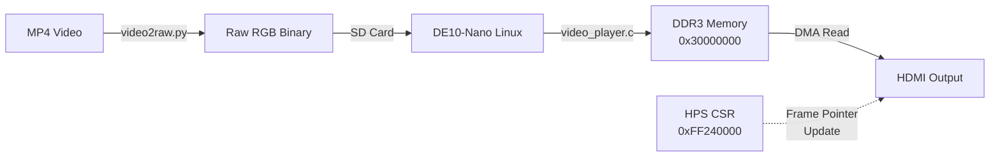

# 🎬 Video Playback Implementation
[**English**] | [**한국어**](./VIDEO_PLAYBACK_kor.md)
[⬅️ Back to README](../README.md)

## Overview

This document describes the implementation of **qHD (960x540@60Hz) video playback** on the DE10-Nano FPGA board, featuring both static image display and dynamic video streaming from Linux.

## 📐 Resolution: qHD (960x540)

### Why qHD?

The original target was 720p (1280x720@60Hz), requiring **222 MB/s** bandwidth:
```
1280 × 720 × 4 bytes × 60 fps = 222 MB/s
```

However, the 50MHz system bus provides only **200 MB/s**:
```
50 MHz × 4 bytes = 200 MB/s
```

To maintain stable 60Hz output with margin, we downgraded to **qHD (960×540)**:
```
960 × 540 × 4 bytes × 60 fps = 124 MB/s  ✅ (62% of available bandwidth)
```

### Timing Parameters

| Parameter | Value |
|-----------|-------|
| **Pixel Clock** | 37.8336 MHz |
| **H_VISIBLE** | 960 |
| **H_FRONT** | 48 |
| **H_SYNC** | 32 |
| **H_BACK** | 80 |
| **H_TOTAL** | 1120 |
| **V_VISIBLE** | 540 |
| **V_FRONT** | 3 |
| **V_SYNC** | 5 |
| **V_BACK** | 15 |
| **V_TOTAL** | 563 |
| **Frame Rate** | 60.00 Hz |

## 🖼️ Static Image Display

### Nios II Software

The Nios II processor can load static images from DDR3 memory and display them on HDMI output.

**Memory Map:**
- Frame Buffer Address: `0x30000000` (Reserved 512MB region in Linux)
- Frame Size: `960 × 540 × 4 = 2,073,600 bytes` (~2MB)

**Software Flow:**
1. Load image data to DDR3 via DMA (`burst_master`)
2. Configure HDMI sync generator registers
3. Set mode to DMA stream (Mode 8)
4. Set frame pointer to `0x30000000`
5. Enable continuous DMA mode

## 🎥 Linux Video Playback

### Architecture



### Components

#### 1. Video Conversion (`video2raw.py`)

Converts standard video files (MP4, AVI) to raw RGB format suitable for the FPGA.

**Features:**
- Resizes to qHD (960×540)
- Converts to BGRA format (32-bit per pixel)
- Frame limiting option (`--frames N`)

**Usage:**
```bash
python video2raw.py input.mp4 --frames 300
```

**Output:**
- File: `video_qhd.bin`
- Size: ~600MB for 300 frames (5 seconds)

#### 2. Video Player (`video_player.c`)

Linux application that streams video frames from SD card to DDR3 using double buffering.

**Memory Mapping:**
- Frame Buffer A: `0x30000000` (Physical)
- Frame Buffer B: `0x30200000` (Physical, +2MB offset)
- HDMI CSR: `0xFF240000` (Physical, via LWHPS2FPGA Bridge)

**Double Buffering Flow:**
```
1. Load Frame N into Back Buffer (A or B)
2. Update HDMI Frame Pointer CSR → Back Buffer Address
3. Swap Front/Back indices
4. Wait ~16.6ms (60 fps target)
5. Repeat
```

**Key Implementation Details:**
- **Circular Read:** Automatically loops video by rewinding file on EOF
- **Adaptive Sleep:** Adjusts sleep time based on actual read duration:
  ```c
  sleep_time = 16.6ms - (read_time + register_update_time)
  ```
- **Direct Memory Access:** Uses `/dev/mem` with `mmap()` for zero-copy transfers

**Compilation:**
```bash
gcc -o video_player video_player.c -O3
```

**Execution:**
```bash
sudo ./video_player video_qhd.bin
```

## 🎬 Video Playback Implementation (RAM Preload Method)

### Overview

To overcome the **SD Card Bandwidth Bottleneck (~20MB/s)**, the video player now uses a **Store-and-Forward** architecture (RAM Preload). 
Instead of streaming from the SD card in real-time, the entire video clip is loaded into the **512MB Reserved DDR3 Memory** before playback starts.

**Advantages:**
- ✅ **Perfect 60fps Playback:** No I/O latency during playback.
- ✅ **Network Streaming Support:** Can pipe video directly from PC via SSH (`cat | ssh`).
- ❌ **Duration Limit:** Max ~4.1 seconds (250 frames) due to 512MB RAM limit.

---

### Usage Guide

#### 1. Host Streaming (Recommended) 📡

Stream video file from your PC directly to the FPGA memory via SSH. No SD card copying required!

**Windows (CMD):**
```cmd
type video_qhd.bin | ssh root@192.168.x.x "./video_player -"
```

**Linux / macOS:**
```bash
cat video_qhd.bin | ssh root@192.168.x.x "./video_player -"
```

*Note: The `-` argument tells the player to read from Standard Input (stdin).*

#### 2. Local File Playback
If the file is already on the SD card:
```bash
./video_player video_qhd.bin
```

---

### Technical Implementation

#### Architecture
1. **Load Phase:** Reads input stream (File or Stdin) and writes sequentially to DDR3 at `0x20000000`.
   - Displays a progress bar (e.g., "Loaded: 50MB").
2. **Play Phase:** Loops through the loaded frames in DDR3, updating the HDMI Frame Pointer CSR every 16.6ms.

#### Memory Map
- **Reserved RAM Base:** `0x20000000` (Upper 512MB of 1GB System RAM)
- **Frame Size:** 2,073,600 bytes (960x540 RGBA)
- **Capacity:** ~258 Frames (Total 535MB, capped at 512MB safely)

#### Kernel Configuration
The Linux Kernel must be configured to reserve the upper 512MB:
- **Boot Args:** `mem=512M`
- **Result:** Linux uses `0x00000000-0x1FFFFFFF`, Video Player uses `0x20000000-0x3FFFFFFF`.

---

### Legacy Method (Direct SD Streaming) - *Deprecated*
*Previous attempts to stream directly from SD card failed to maintain 60fps due to 20MB/s read speed vs 124MB/s required bandwidth.*

## ⚠️ Performance Limitations

### SD Card Bottleneck

**Required Bandwidth:** 124 MB/s (for 60fps qHD)  
**Typical SD Card Read Speed:** 20-40 MB/s

**Observed Behavior:**
1. **Initial Phase:** Smooth playback (Linux page cache providing buffered data)
2. **Sustained Phase:** Stuttering (~10-15 fps actual) as cache depletes

**Mitigation Options:**
1. **RAM Preload (Removed):** Load entire video into DDR3 before playback
   - Pros: Perfect 60fps, no SD access during playback
   - Cons: Limited to ~250 frames (4 seconds) due to 512MB memory limit
2. **Lower Resolution:** Reduce to 480p or lower to fit SD card bandwidth
3. **Accept Lower FPS:** Current implementation for long video support

## 🔧 Hardware Modifications

### RTL Changes

#### 1. Dual-Clock Architecture ([hdmi_sync_gen.v](file:///C:/Workspace/quartus/video_processing/RTL/hdmi_sync_gen.v))
- `clk` (50MHz): CSR register access
- `clk_pixel` (37.8MHz): HDMI timing generation
- Proper Clock Domain Crossing (CDC) using synchronizer chains

#### 2. Frame Pointer Latching
```verilog
// Shadow pointer updates on V-Sync edge (CSR domain)
always @(posedge clk) begin
    if (vs_sync_sh[1] && !vs_sync_sh[2]) begin
        shadow_ptr <= reg_frame_ptr;  // Atomic swap
    end
end
```

This ensures tear-free video by synchronizing frame pointer updates with vertical blanking.

#### 3. HDMI Sync Polarity
```verilog
hdmi_hs <= ~hs_d1;  // Active-LOW
hdmi_vs <= ~vs_d1;  // Active-LOW
```

### Verification

Extensive Cocotb testbenches validated:
- ✅ Dual-clock domain synchronization
- ✅ DMA read timing alignment
- ✅ FIFO depth sufficiency (1024 entries)
- ✅ Multi-frame capture correctness
- ✅ V-Sync based frame pointer latching

## 📊 Results

### ✅ Achievements

| Feature | Status | Details |
|---------|--------|---------|
| **Static Image (Nios II)** | ✅ Working | 960×540 RGB images via DMA |
| **Video Playback (Linux)** | ✅ Working | Double-buffered streaming |
| **Frame Rate (Cached)** | ✅ 60fps | Initial smooth playback |
| **Frame Rate (Sustained)** | ⚠️ 10-15fps | SD card limited |
| **V-Sync Synchronization** | ✅ Working | No tearing observed |
| **Seamless Loop** | ✅ Working | Circular file reading |

### 📸 Test Results

- Successfully displayed test patterns (color bars, gradients, character tiles)
- Loaded and displayed static PNG/BMP images
- Streamed 30-second MP4 video (with expected fps drop after cache exhaustion)
- Verified register access from both Nios II and Linux HPS

## 📝 Lessons Learned

1. **Bandwidth Budgeting:** Always verify bus bandwidth vs. pixel clock requirements early
2. **Clock Domain Crossing:** Essential for stable dual-clock video pipelines
3. **V-Sync Synchronization:** Critical for tear-free updates when changing frame buffers
4. **SD Card Limits:** Raw video requires massive bandwidth; compression or lower resolution needed for sustained playback
5. **Bridge Configuration:** Platform Designer connections must include all relevant masters (HPS, Nios, DMA)

## 🔗 References

- [HDMI Timing Calculator](http://tinyvga.com/vga-timing)
- [ADV7513 Programming Guide](https://www.analog.com/media/en/technical-documentation/user-guides/ADV7513_Programming_Guide.pdf)
- [Cyclone V HPS Technical Reference Manual](https://www.intel.com/content/www/us/en/docs/programmable/683126/current/hard-processor-system-technical-reference.html)

---

**[← Back to README](../README.md)**
