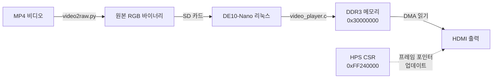

# 🎬 비디오 재생 구현
[**English**](./VIDEO_PLAYBACK.md) | [**한국어**]
[⬅️ README로 돌아가기](../README_kor.md)

## 개요
이 문서는 정적 이미지 디스플레이와 리눅스 서버로부터의 동적 비디오 스트리밍을 포함하여, DE10-Nano FPGA 보드에서 구현된 **qHD (960x540@60Hz) 비디오 재생**에 대해 설명합니다.

## 📐 해상도: qHD (960x540)

### 왜 qHD인가?
원래 목표는 720p (1280x720@60Hz)였으며, 이는 **222 MB/s**의 대역폭을 필요로 합니다.
```
1280 × 720 × 4 바이트 × 60 fps = 222 MB/s
```

그러나 50MHz 시스템 버스는 최대 **200 MB/s**만 제공할 수 있습니다.
```
50 MHz × 4 바이트 = 200 MB/s
```

여유 있는 대역폭과 안정적인 60Hz 출력을 유지하기 위해 해상도를 **qHD (960×540)**로 낮추었습니다.
```
960 × 540 × 4 바이트 × 60 fps = 124 MB/s ✅ (가용 대역폭의 62% 사용)
```

### 타이밍 파라미터

| 파라미터 | 값 |
|-----------|-------|
| **픽셀 클록** | 37.8336 MHz |
| **H_VISIBLE** | 960 |
| **H_FRONT** | 48 |
| **H_SYNC** | 32 |
| **H_BACK** | 80 |
| **H_TOTAL** | 1120 |
| **V_VISIBLE** | 540 |
| **V_FRONT** | 3 |
| **V_SYNC** | 5 |
| **V_BACK** | 15 |
| **V_TOTAL** | 563 |
| **프레임 레이트** | 60.00 Hz |

## 🖼️ 정적 이미지 디스플레이

### Nios II 소프트웨어
Nios II 프로세서는 DDR3 메모리에서 정적 이미지를 로드하여 HDMI 출력으로 표시할 수 있습니다.

**메모리 맵:**
- 프레임 버퍼 주소: `0x30000000` (리눅스에서 예약된 512MB 영역)
- 프레임 크기: `960 × 540 × 4 = 2,073,600 바이트` (약 2MB)

**소프트웨어 흐름:**
1. DMA(`burst_master`)를 통해 이미지 데이터를 DDR3로 로드
2. HDMI 싱크 제네레이터 레지스터 구성
3. 모드를 DMA 스트림(Mode 8)으로 설정
4. 프레임 포인터를 `0x30000000`으로 설정
5. 연속 DMA 모드 활성화

## 🎥 리눅스 비디오 재생

### 아키텍처


### 구성 요소

#### 1. 비디오 변환 (`video2raw.py`)
표준 비디오 파일(MP4, AVI)을 FPGA에 적합한 원본 RGB 포맷으로 변환합니다.

**기능:**
- qHD(960×540)로 해상도 조절
- BGRA 포맷(픽셀당 32비트)으로 변환
- 프레임 제한 옵션 (`--frames N`)

**사용법:**
```bash
python video2raw.py input.mp4 --frames 300
```

#### 2. 비디오 플레이어 (`video_player.c`)
SD 카드에서 DDR3로 비디오 프레임을 스트리밍하는 리눅스 애플리케이션으로, 더블 버퍼링을 사용합니다.

**메모리 매핑:**
- 프레임 버퍼 A: `0x30000000` (물리 주소)
- 프레임 버퍼 B: `0x30200000` (물리 주소, +2MB 오프셋)
- HDMI CSR: `0xFF240000` (물리 주소, LWHPS2FPGA 브릿지 경유)

**더블 버퍼링 흐름:**
1. N번째 프레임을 백 버퍼(A 또는 B)에 로드
2. HDMI 프레임 포인터 CSR을 백 버퍼 주소로 업데이트
3. 프론트/백 인덱스 교체
4. 약 16.6ms 대기 (60fps 목표)
5. 반복

**핵심 구현 상세:**
- **순환 읽기**: 파일 끝(EOF) 도달 시 파일을 처음으로 되감아 자동으로 비디오를 루프 재생합니다.
- **적응형 대기(Adaptive Sleep)**: 실제 읽기 시간에 따라 대기 시간을 조정합니다.
- **직접 메모리 액세스**: 제로 카피(Zero-copy) 전송을 위해 `mmap()`과 `/dev/mem`을 사용합니다.

## 🎬 비디오 재생 구현 (RAM 사전 로드 방식)

### 개요
**SD 카드 대역폭 병목 현상 (~20MB/s)**을 극복하기 위해, 비디오 플레이어는 이제 **Store-and-Forward** 아키텍처(RAM 사전 로드)를 사용합니다. 실시간으로 SD 카드에서 스트리밍하는 대신, 재생 시작 전 전체 비디오 클립을 **512MB 예약 DDR3 메모리**에 모두 로드합니다.

**장점:**
- ✅ **완벽한 60fps 재생**: 재생 중 I/O 지연이 전혀 발생하지 않습니다.
- ✅ **네트워크 스트리밍 지원**: SSH를 통해 PC에서 FPGA 메모리로 직접 비디오를 파이핑할 수 있습니다 (`cat | ssh`).
- ❌ **재생 시간 제한**: 512MB RAM 제한으로 인해 최대 약 4.1초(250 프레임)까지만 가능합니다.

### 사용 가이드

#### 1. 호스트 스트리밍 (권장) 📡
PC의 비디오 파일을 SSH를 통해 FPGA 메모리로 직접 스트리밍합니다. SD 카드로 복사할 필요가 없습니다!

**Windows (CMD):**
```cmd
type video_qhd.bin | ssh root@192.168.x.x "./video_player -"
```

**Linux / macOS:**
```bash
cat video_qhd.bin | ssh root@192.168.x.x "./video_player -"
```
*참고: `-` 인자는 플레이어에게 표준 입력(stdin)으로부터 읽도록 지시합니다.*

#### 2. 로컬 파일 재생
파일이 이미 SD 카드에 있는 경우:
```bash
./video_player video_qhd.bin
```

### 기술 구현 상세

#### 아키텍처
1. **로드 단계**: 입력 스트림(파일 또는 Stdin)을 읽어 `0x20000000`부터 DDR3에 순차적으로 기록합니다.
2. **재생 단계**: DDR3에 로드된 프레임을 루프하며 16.6ms마다 HDMI 프레임 포인터 CSR을 업데이트합니다.

#### 메모리 맵
- **예약 RAM 베이스**: `0x20000000` (1GB 시스템 RAM 중 상위 512MB)
- **프레임 크기**: 2,073,600 바이트 (960x540 RGBA)
- **용량**: 약 258 프레임 (총 535MB이나 안전하게 512MB로 제한)

#### 커널 설정
리눅스 커널이 상위 512MB를 예약하도록 설정되어야 합니다.
- **부팅 인자(Boot Args)**: `mem=512M`
- **결과**: 리눅스는 `0x00000000-0x1FFFFFFF`를 사용하고, 비디오 플레이어는 `0x20000000-0x3FFFFFFF`를 사용합니다.

## ⚠️ 성능 제한 사항

### SD 카드 병목 현상
**필요 대역폭**: 124 MB/s (60fps qHD 기준)
**일반적인 SD 카드 읽기 속도**: 20-40 MB/s

**관찰된 동작:**
1. **초기 단계**: 부드러운 재생 (리눅스 페이지 캐시가 버퍼링된 데이터 제공)
2. **지속 단계**: 캐시 소진 시 끊김 현상 발생 (실제 약 10-15 fps)

**해결 방안:**
1. **RAM 사전 로드 (현재 방식)**: 재생 전 전체 비디오를 DDR3로 로드
2. **해상도 낮춤**: SD 카드 대역폭에 맞게 480p 이하로 축소
3. **낮은 FPS 수용**: 긴 비디오 지원을 위한 현재의 대안

## 🔧 하드웨어 수정 사항

### RTL 변경 사항

#### 1. 듀얼 클록 아키텍처 ([hdmi_sync_gen.v](../RTL/hdmi_sync_gen.v))
- `clk` (50MHz): CSR 레지스터 액세스용
- `clk_pixel` (37.8MHz): HDMI 타이밍 생성용
- 동기화 체인을 사용한 적절한 클록 도메인 교차(CDC) 구현

#### 2. 프레임 포인터 래칭 (Latching)
브이싱크(V-Sync) 엣지에서 쉐도우 포인터를 업데이트하여 티어링 없는 비디오를 보장합니다.

### 검증
Cocotb 테스트벤치를 통해 다음 사항들을 검증했습니다:
- ✅ 듀얼 클록 도메인 동기화
- ✅ DMA 읽기 타이밍 정렬
- ✅ FIFO 깊이 적절성 (1024 엔트리)
- ✅ 다중 프레임 캡처 정확성
- ✅ V-Sync 기반 프레임 포인터 래칭

## 📊 결과

### 성과 요약

| 기능 | 상태 | 상세 내용 |
|---------|--------|---------|
| **정적 이미지 (Nios II)** | ✅ 정상 동작 | DMA를 통한 960×540 RGB 이미지 출력 |
| **비디오 재생 (리눅스)** | ✅ 정상 동작 | 더블 버퍼링 기반 스트리밍 |
| **프레임 레이트 (캐시됨)** | ✅ 60fps | 초기 재생 시 원활함 |
| **프레임 레이트 (지속됨)** | ⚠️ 10-15fps | SD 카드 속도 제한 |
| **V-Sync 동기화** | ✅ 정상 동작 | 티어링 현상 없음 |
| **심리스 루프** | ✅ 정상 동작 | 순환 파일 읽기 구현 |

## 📝 교훈
1. **대역폭 예산 수립**: 초기 단계에서 픽셀 클록 요구 사항과 버스 대역폭을 반드시 확인해야 합니다.
2. **클록 도메인 교차**: 안정적인 듀얼 클록 비디오 파이프라인을 구축하는 데 필수적입니다.
3. **V-Sync 동기화**: 프레임 버퍼를 교체할 때 티어링 없는 업데이트를 위해 매우 중요합니다.
4. **SD 카드 한계**: 원본 비디오는 막대한 대역폭을 필요로 하므로, 지속적인 재생을 위해서는 압축 기술이나 해상도 타협이 필요합니다.

## 🔗 참고 문헌
- [HDMI Timing Calculator](http://tinyvga.com/vga-timing)
- [ADV7513 Programming Guide](https://www.analog.com/media/en/technical-documentation/user-guides/ADV7513_Programming_Guide.pdf)

---
**[⬅️ README로 돌아가기](../README_kor.md)**
